# Kgent 기반 검증강화 설계

> **주제:** Kgent 논문을 기반으로 한 eBPF 코드 생성·검증 구조 분석과, 검증 이후 성능 평가 및 반복 최적화까지 포함하는 심층 구조 설계  
> **핵심 키워드:** Kgent, eBPF, LLM, Symbolic Verifier, eBPF Verifier, Hoare Logic, Checkpoint, Score, Optimize, Rollback  
> **구분:**  
> - **논문 기반 구조:** Kgent의 기존 eBPF 생성·검증 파이프라인  
> - **제안 확장 구조:** 검증 이후 평가·점수화·최적화·재검증을 포함한 심층 구조  

---

## 참고 출처

본 보고서는 다음 자료를 바탕으로 작성하였다.

1. Yusheng Zheng, Yiwei Yang, Maolin Chen, Andrew Quinn,  
   **“Kgent: Kernel Extensions Large Language Model Agent”**,  
   Proceedings of the ACM SIGCOMM 2024 Workshop on eBPF and Kernel Extensions, eBPF ’24, pp. 30–36, 2024.  
   DOI: https://doi.org/10.1145/3672197.3673434

2. Kgent GitHub Repository,  
   **eunomia-bpf/KEN: Kernel Extensions Large Language Model Agent**  
   https://github.com/eunomia-bpf/KEN

3. Linux Kernel Documentation,  
   **eBPF verifier**  
   https://docs.kernel.org/bpf/verifier.html

4. Eunomia Blog,  
   **Simplifying Kernel Programming: The LLM-Powered eBPF Tool**  
   https://eunomia.dev/blogs/kgent/

---

## 목차

1. 연구 배경  
2. eBPF와 OS 개발 보조 시스템의 필요성  
3. Kgent 논문 기반 기존 구조  
4. 기존 Kgent 구조의 단계별 상세 설명  
5. 기존 Kgent 구조의 의의  
6. 기존 Kgent 구조의 한계  
7. 제안 구조: Kgent 기반 검증 심층구조  
8. 확장 구조의 단계별 상세 설명  
9. Tag 기반 분류와 유형별 가중치 평가  
10. Checkpoint와 Rollback 구조  
11. 구현 방향성  
12. 기대 효과  
13. 결론  

---

# 1. 연구 배경

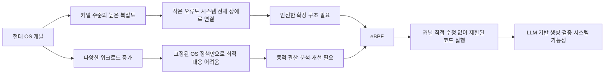
```mermaid
flowchart LR
    A[현대 OS 개발] --> B[커널 수준의 높은 복잡도]
    B --> C[작은 오류도 시스템 전체 장애로 연결]
    C --> D[안전한 확장 구조 필요]

    A --> E[다양한 워크로드 증가]
    E --> F[고정된 OS 정책만으로 최적 대응 어려움]
    F --> G[동적 관찰·분석·개선 필요]

    D --> H[eBPF]
    G --> H
    H --> I[커널 직접 수정 없이 제한된 코드 실행]
    I --> J[LLM 기반 생성·검증 시스템 가능성]
```

현대 운영체제는 안정성과 성능을 위해 매우 보수적으로 설계된다.  
커널 내부 코드는 시스템 전체의 실행과 직접 연결되므로, 작은 오류 하나가 전체 시스템 장애, 보안 취약점, 성능 저하로 이어질 수 있다.

하지만 실제 컴퓨팅 환경은 점점 복잡해지고 있다.  
네트워크 트래픽, 보안 이벤트, 프로세스 실행 패턴, 파일 시스템 접근, 메모리 사용량 등은 고정된 정책만으로 항상 최적화하기 어렵다.

이러한 상황에서 **eBPF**는 중요한 가능성을 제공한다.  
eBPF는 커널을 직접 수정하지 않고도 제한된 프로그램을 커널 이벤트에 연결할 수 있는 구조이다. 따라서 OS 내부를 관찰하거나 특정 동작을 추적하면서도, 커널 전체를 다시 빌드하거나 직접 수정하지 않아도 된다.

여기에 LLM을 결합하면, 사용자가 자연어로 원하는 동작을 설명하고, LLM이 이를 eBPF 코드로 생성하며, verifier가 안전성을 검사하는 구조를 만들 수 있다.  
이 아이디어를 구체화한 대표적인 연구가 **Kgent**이다.

---

# 2. eBPF와 OS 개발 보조 시스템의 필요성

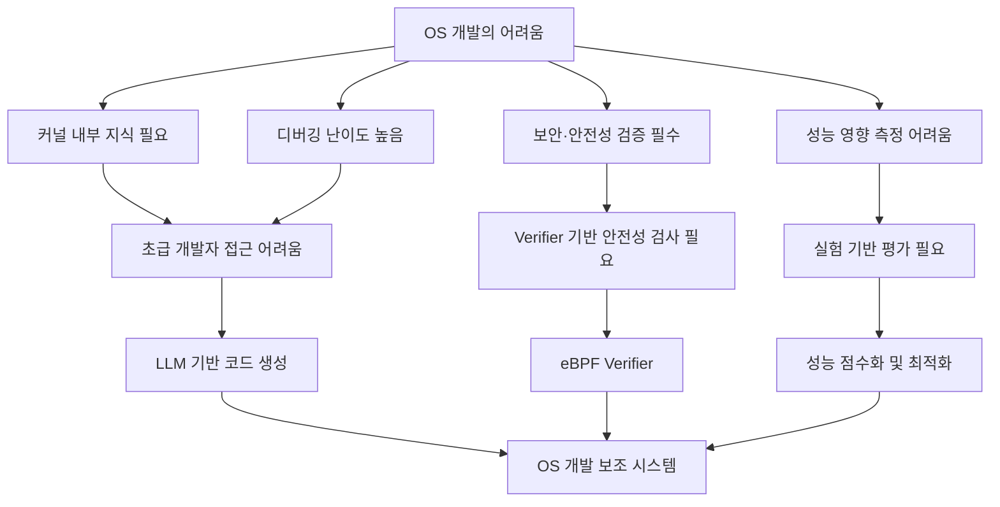
```mermaid
flowchart TD
    A[OS 개발의 어려움] --> B[커널 내부 지식 필요]
    A --> C[디버깅 난이도 높음]
    A --> D[보안·안전성 검증 필수]
    A --> E[성능 영향 측정 어려움]

    B --> F[초급 개발자 접근 어려움]
    C --> F
    D --> G[Verifier 기반 안전성 검사 필요]
    E --> H[실험 기반 평가 필요]

    F --> I[LLM 기반 코드 생성]
    G --> J[eBPF Verifier]
    H --> K[성능 점수화 및 최적화]

    I --> L[OS 개발 보조 시스템]
    J --> L
    K --> L
```

OS 개발이 어려운 이유는 단순히 코드가 길거나 문법이 복잡하기 때문만은 아니다.  
운영체제는 하드웨어, 메모리, 프로세스, 스케줄링, 파일 시스템, 네트워크, 보안 정책 등 다양한 요소가 결합된 시스템이다.

특히 커널 수준의 코드는 다음과 같은 어려움을 가진다.

- 잘못된 메모리 접근은 커널 패닉이나 보안 취약점으로 이어질 수 있다.
- 무한 루프나 과도한 자원 사용은 전체 시스템 성능에 영향을 줄 수 있다.
- 커널 함수나 자료구조에 대한 깊은 이해가 필요하다.
- 기능적으로 맞는 코드라도 실제 성능이 좋은지는 별도로 검증해야 한다.
- 안전하게 실행되는 코드와 효율적인 코드는 같은 의미가 아니다.

따라서 OS 개발을 보조하는 시스템은 단순히 코드를 생성하는 수준에 머물러서는 부족하다.  
다음과 같은 단계가 함께 필요하다.

1. 사용자의 요구사항 이해  
2. 커널 확장 코드 생성  
3. 안전성 검증  
4. 의미적 정확성 검증  
5. 성능 및 효율성 평가  
6. 개선점 분석  
7. 제한된 범위의 최적화  
8. 재검증 및 rollback  

Kgent는 이 중에서 특히 **자연어 요구사항을 eBPF 코드로 변환하고, symbolic verifier와 eBPF verifier를 통해 검증하는 구조**를 제안한다.

---

# 3. Kgent 논문 기반 기존 구조

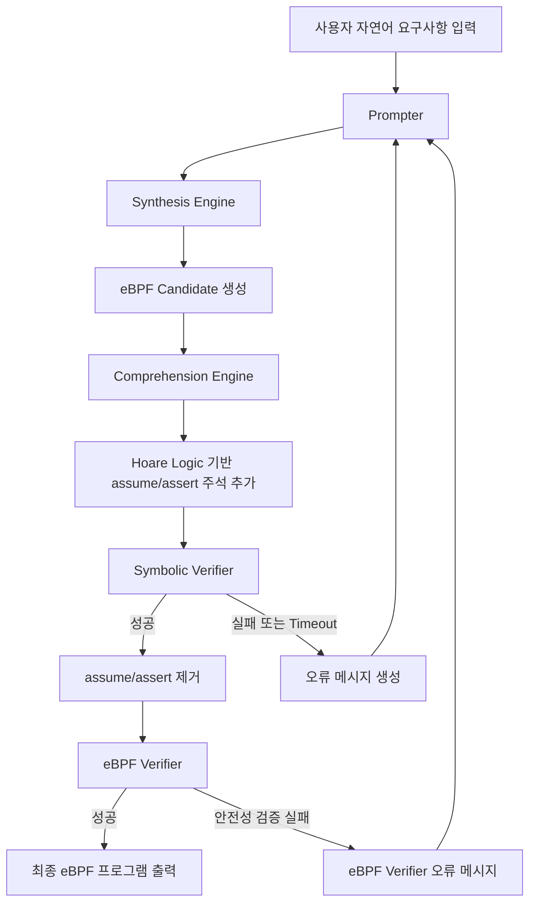
```mermaid
flowchart TD
    A[사용자 자연어 요구사항 입력] --> B[Prompter]
    B --> C[Synthesis Engine]
    C --> D[eBPF Candidate 생성]
    D --> E[Comprehension Engine]
    E --> F[Hoare Logic 기반 assume/assert 주석 추가]
    F --> G[Symbolic Verifier]

    G -->|성공| H[assume/assert 제거]
    H --> I[eBPF Verifier]
    I -->|성공| J[최종 eBPF 프로그램 출력]

    G -->|실패 또는 Timeout| K[오류 메시지 생성]
    K --> B

    I -->|안전성 검증 실패| L[eBPF Verifier 오류 메시지]
    L --> B
```

Kgent는 사용자가 자연어로 작성한 요구사항을 바탕으로 eBPF 프로그램을 생성하고, 이를 여러 단계의 검증 과정을 통해 안전한 eBPF 코드로 산출하는 시스템이다.

Kgent의 핵심 구성 요소는 다음과 같다.

| 구성 요소 | 역할 |
|---|---|
| Prompter | 사용자 요구사항과 이전 오류 메시지를 LLM에 전달하기 좋은 형태로 구성 |
| Synthesis Engine | LLM을 이용해 자연어 요구사항으로부터 후보 eBPF 코드 생성 |
| Comprehension Engine | 후보 코드에 대해 Hoare logic 기반 전제조건과 후조건 생성 |
| Symbolic Verifier | 생성된 조건이 코드에서 만족되는지 symbolic execution으로 검증 |
| eBPF Verifier | 운영체제의 기존 eBPF verifier를 사용하여 안전성 검사 |
| Feedback Loop | 검증 실패 시 오류 메시지를 다시 Prompter로 전달하여 재생성 유도 |

즉, Kgent의 핵심은 단순한 “LLM 코드 생성기”가 아니라,  
**LLM 기반 코드 생성 + LLM 기반 코드 이해 + symbolic execution + eBPF verifier + feedback loop**가 결합된 구조이다.

---

# 4. 기존 Kgent 구조의 단계별 상세 설명

## 4.1 Prompter

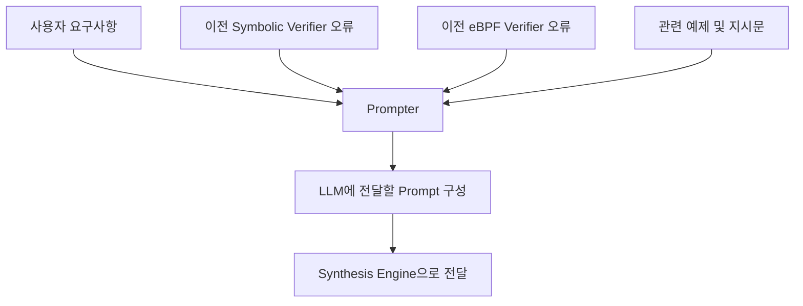
```mermaid
flowchart TD
    A[사용자 요구사항] --> B[Prompter]
    C[이전 Symbolic Verifier 오류] --> B
    D[이전 eBPF Verifier 오류] --> B
    E[관련 예제 및 지시문] --> B

    B --> F[LLM에 전달할 Prompt 구성]
    F --> G[Synthesis Engine으로 전달]
```

Prompter는 사용자의 자연어 요구사항을 그대로 LLM에 넘기는 역할만 하지 않는다.  
Kgent에서 Prompter는 다음 정보를 조합하여 Synthesis Engine에 전달한다.

- 사용자의 원래 요구사항
- eBPF 프로그램을 생성하라는 지시문
- bpftrace 또는 libbpf 형식에 맞춘 코드 작성 요구
- 이전 반복에서 발생한 오류 메시지
- verifier 실패 원인
- 관련 예제 또는 문맥 정보

이 구조가 중요한 이유는 LLM이 한 번에 정확한 코드를 생성하지 못할 수 있기 때문이다.  
따라서 이전 실패 정보를 다음 prompt에 포함시키면, LLM은 이전 오류를 반영하여 더 나은 후보 코드를 생성할 가능성이 높아진다.

즉, Prompter는 단순 입력창이 아니라 **feedback을 누적하고 재생성 방향을 제어하는 중심 모듈**이다.

---

## 4.2 Synthesis Engine

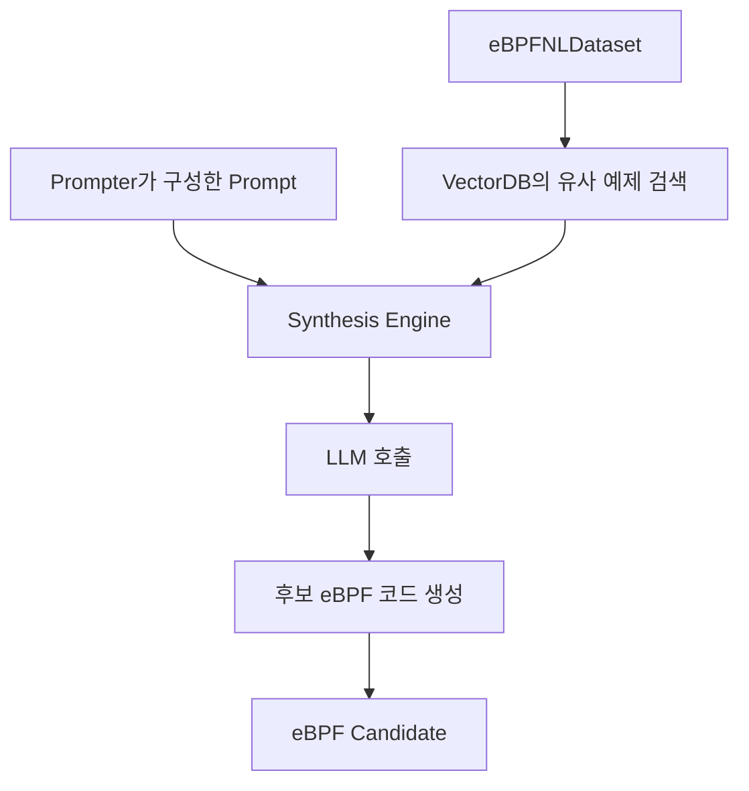
```mermaid
flowchart TD
    A[Prompter가 구성한 Prompt] --> B[Synthesis Engine]
    C[VectorDB의 유사 예제 검색] --> B
    D[eBPFNLDataset] --> C

    B --> E[LLM 호출]
    E --> F[후보 eBPF 코드 생성]
    F --> G[eBPF Candidate]
```

Synthesis Engine은 자연어 요구사항을 바탕으로 후보 eBPF 프로그램을 생성한다.

Kgent 논문에서는 LLM이 eBPF 코드를 더 잘 생성할 수 있도록, 자연어 prompt와 eBPF 코드 쌍을 저장한 데이터셋과 VectorDB를 활용한다.  
이 방식은 사용자의 요구사항과 유사한 기존 예제를 검색하여 prompt에 포함시키는 방식이며, 넓게 보면 few-shot 또는 retrieval-augmented generation 방식과 유사하다.

논문에서 제시된 eBPFNLDataset은 자연어 prompt와 eBPF 프로그램 쌍으로 구성되어 있으며, bpftrace와 libbpf 예제를 포함한다.

이 단계의 출력은 아직 최종 코드가 아니다.  
출력은 **검증 전 후보 코드**, 즉 `eBPF Candidate`이다.

---

## 4.3 Comprehension Engine

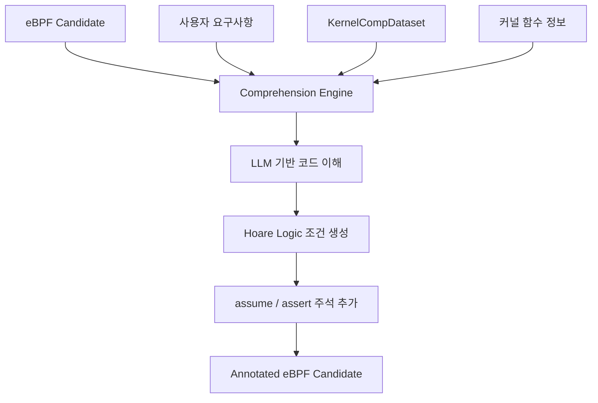
```mermaid
flowchart TD
    A[eBPF Candidate] --> B[Comprehension Engine]
    C[사용자 요구사항] --> B
    D[KernelCompDataset] --> B
    E[커널 함수 정보] --> B

    B --> F[LLM 기반 코드 이해]
    F --> G[Hoare Logic 조건 생성]
    G --> H[assume / assert 주석 추가]
    H --> I[Annotated eBPF Candidate]
```

Comprehension Engine은 Kgent의 중요한 특징 중 하나이다.

일반적인 코드 생성 시스템은 LLM이 코드를 만들고 나면 그 코드가 맞는지 단순히 실행하거나 컴파일하는 수준에 그칠 수 있다.  
하지만 Kgent는 생성된 eBPF 코드에 대해 **Hoare logic 기반의 전제조건과 후조건**을 생성한다.

Hoare logic은 간단히 말해 다음과 같은 형태로 프로그램의 의미를 표현하는 방식이다.

```text
{Precondition} Program {Postcondition}
```

즉,

- 이 코드가 실행되기 전에 무엇이 참이어야 하는가?
- 이 코드가 실행된 후 무엇이 보장되어야 하는가?

를 조건으로 표현한다.

Kgent의 Comprehension Engine은 후보 eBPF 프로그램이 호출하는 커널 함수에 대해 전제조건과 후조건을 생성하고, 이를 `assume`과 `assert` 형태로 후보 코드에 주석처럼 삽입한다.

이 단계의 의미는 크다.  
왜냐하면 LLM이 생성한 코드의 의미를 다시 LLM이 분석하고, 그 의미를 symbolic verifier가 검사할 수 있는 형태로 변환하기 때문이다.

즉, Comprehension Engine은  
**자연어 요구사항과 코드 사이의 의미적 연결을 검증 가능한 조건으로 바꾸는 단계**이다.

---

## 4.4 Symbolic Verifier

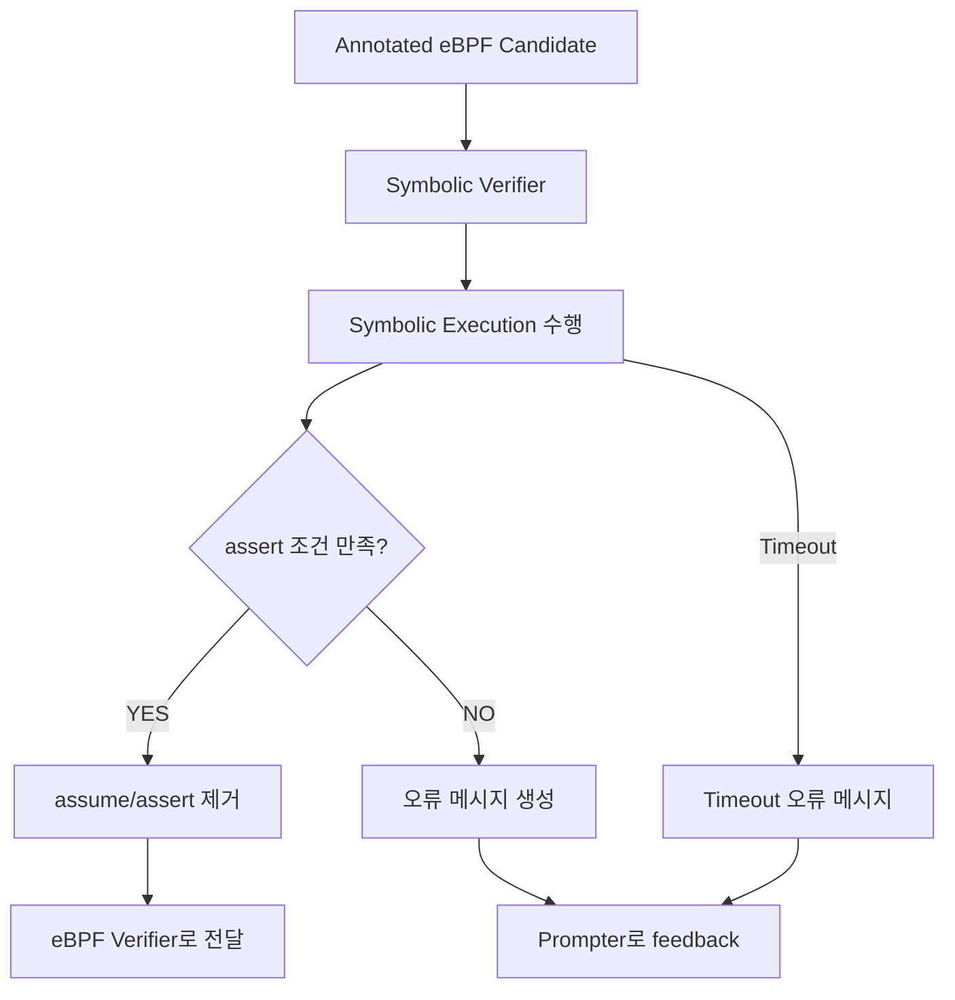
```mermaid
flowchart TD
    A[Annotated eBPF Candidate] --> B[Symbolic Verifier]
    B --> C[Symbolic Execution 수행]
    C --> D{assert 조건 만족?}

    D -->|YES| E[assume/assert 제거]
    E --> F[eBPF Verifier로 전달]

    D -->|NO| G[오류 메시지 생성]
    G --> H[Prompter로 feedback]

    C -->|Timeout| I[Timeout 오류 메시지]
    I --> H
```

Symbolic Verifier는 Comprehension Engine이 생성한 Hoare logic 조건을 실제 후보 코드가 만족하는지 검사한다.

symbolic execution은 프로그램을 구체적인 입력값 하나로 실행하는 것이 아니라, 입력값을 기호로 두고 가능한 실행 경로를 분석하는 방식이다.  
이를 통해 특정 조건이 항상 만족되는지, 어떤 경로에서 위반되는지를 분석할 수 있다.

Kgent에서는 Symbolic Verifier가 다음을 판단한다.

- 후보 코드가 `assert` 조건을 만족하는가?
- 전제조건과 후조건이 코드 흐름에서 위배되지 않는가?
- 검증이 시간 안에 끝나는가?
- symbolic execution 도중 실패하는 경로가 있는가?

만약 Symbolic Verifier가 성공하면, 후보 코드에서 검증용 `assume/assert`를 제거한 뒤 eBPF Verifier로 넘긴다.

반대로 실패하거나 timeout이 발생하면 오류 메시지를 Prompter로 다시 전달한다.  
이 feedback은 다음 LLM 생성 과정에 반영된다.

---

## 4.5 eBPF Verifier

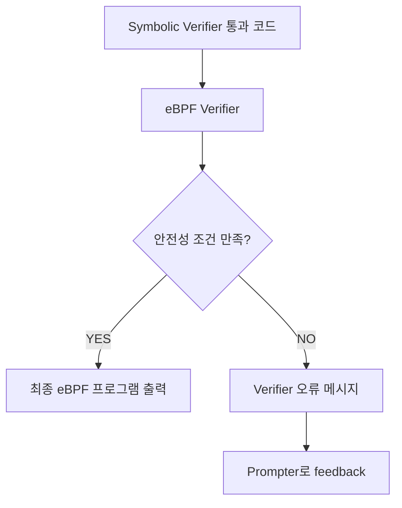
```mermaid
flowchart TD
    A[Symbolic Verifier 통과 코드] --> B[eBPF Verifier]
    B --> C{안전성 조건 만족?}

    C -->|YES| D[최종 eBPF 프로그램 출력]
    C -->|NO| E[Verifier 오류 메시지]
    E --> F[Prompter로 feedback]
```

eBPF Verifier는 운영체제에 존재하는 기존 안전성 검증 장치이다.

eBPF 프로그램은 커널 내부에서 실행될 수 있기 때문에, 실행 전에 반드시 verifier를 통과해야 한다.  
Linux eBPF Verifier는 프로그램의 제어 흐름, 레지스터 상태, 스택 접근, 메모리 접근, helper function 호출 등을 분석하여 안전하지 않은 프로그램을 거부한다.

대표적으로 다음과 같은 위험을 검사한다.

- 무한 루프 또는 종료가 보장되지 않는 루프
- 허용되지 않은 메모리 접근
- 초기화되지 않은 값 사용
- 잘못된 포인터 연산
- 잘못된 helper function 호출
- 프로그램 타입에 맞지 않는 context 접근

이 단계는 Kgent 구조에서 마지막 안전성 검증 단계이다.  
Symbolic Verifier가 의미적 조건을 검사한다면, eBPF Verifier는 커널에서 실행 가능한 안전한 eBPF 프로그램인지 검사한다.

---

# 5. 기존 Kgent 구조의 의의


```mermaid
flowchart LR
    A[자연어 요구사항] --> B[LLM 코드 생성]
    B --> C[LLM 코드 이해]
    C --> D[Hoare Logic 조건화]
    D --> E[Symbolic Execution 검증]
    E --> F[eBPF Verifier 안전성 검사]
    F --> G[검증된 eBPF 코드]
```

Kgent 구조의 의의는 다음과 같다.

첫째, 자연어로 커널 확장 프로그램을 작성할 수 있는 가능성을 제시한다.  
eBPF 프로그램 작성은 일반 개발자에게 어렵다. 커널 내부 구조, hook point, helper function, verifier 제약을 이해해야 하기 때문이다. Kgent는 이 진입 장벽을 낮추는 구조를 제안한다.

둘째, 단순 LLM 코드 생성보다 안전하다.  
LLM이 생성한 코드를 바로 사용하는 것이 아니라, Comprehension Engine과 Symbolic Verifier를 통해 의미적 조건을 확인하고, 마지막으로 eBPF Verifier를 통해 커널 실행 안전성을 검사한다.

셋째, feedback loop를 통해 반복 개선이 가능하다.  
한 번 실패했다고 종료하지 않고, 실패 원인을 다시 prompt에 포함시켜 재생성을 유도한다.

넷째, LLM의 코드 생성 능력과 코드 이해 능력을 결합한다.  
Synthesis Engine은 코드를 만들고, Comprehension Engine은 그 코드의 의미를 조건화한다. 이 둘을 symbolic execution과 연결한 것이 Kgent의 중요한 설계적 특징이다.

---

# 6. 기존 Kgent 구조의 한계

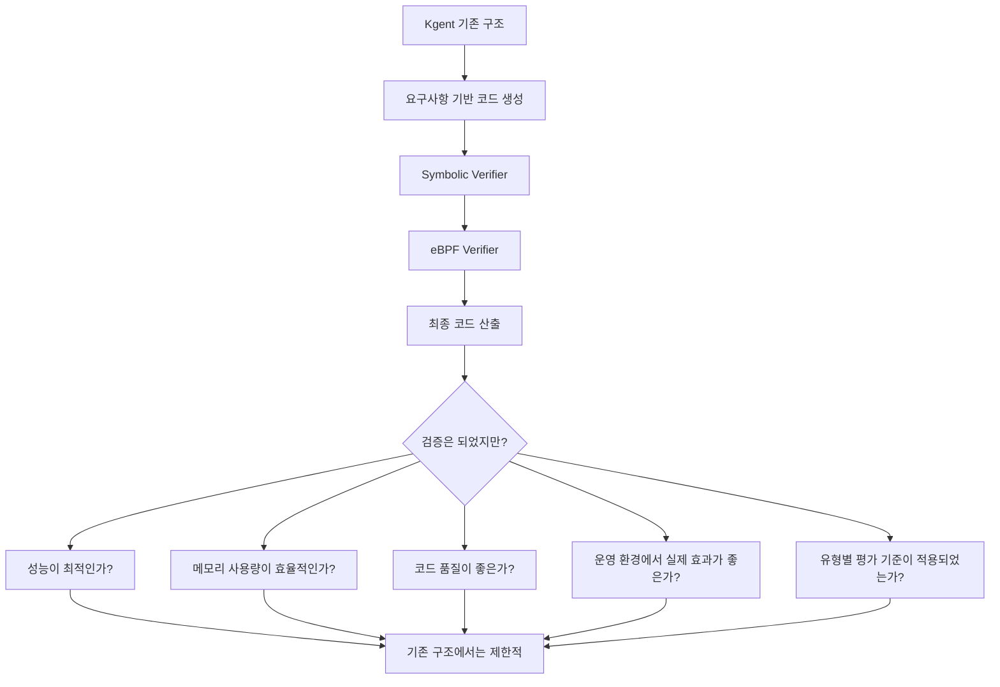
```mermaid
flowchart TD
    A[Kgent 기존 구조] --> B[요구사항 기반 코드 생성]
    B --> C[Symbolic Verifier]
    C --> D[eBPF Verifier]
    D --> E[최종 코드 산출]

    E --> F{검증은 되었지만?}

    F --> G[성능이 최적인가?]
    F --> H[메모리 사용량이 효율적인가?]
    F --> I[코드 품질이 좋은가?]
    F --> J[운영 환경에서 실제 효과가 좋은가?]
    F --> K[유형별 평가 기준이 적용되었는가?]

    G --> L[기존 구조에서는 제한적]
    H --> L
    I --> L
    J --> L
    K --> L
```

Kgent는 매우 의미 있는 구조이지만, 보고서 관점에서 다음과 같은 한계를 지적할 수 있다.

## 6.1 verifier-safe와 optimal은 다르다

Kgent의 최종 목표는 verifier를 통과하는 의미적으로 올바른 eBPF 프로그램을 생성하는 것이다.  
하지만 verifier를 통과했다는 사실이 곧 최적의 코드라는 뜻은 아니다.

예를 들어 어떤 eBPF 프로그램이 안전하게 실행될 수는 있지만, 다음과 같은 문제가 남을 수 있다.

- 너무 많은 map 접근을 수행한다.
- 이벤트마다 불필요한 연산을 반복한다.
- trace 대상이 너무 넓어 오버헤드가 크다.
- 비슷한 기능을 더 단순한 hook으로 구현할 수 있다.
- 요구사항은 만족하지만 운영 환경에서 성능이 낮다.

즉, Kgent는 **검증된 코드 생성**에는 강하지만, **검증 이후의 성능 최적화 구조**는 상대적으로 약하다.

## 6.2 성능 평가 단계가 명시적으로 부족하다

기존 구조는 다음과 같은 흐름에 가깝다.

```text
요구사항
→ 코드 생성
→ 의미 검증
→ 안전성 검증
→ 코드 산출
```

하지만 실제 OS 개발에서는 다음 질문도 중요하다.

```text
이 코드가 얼마나 빠른가?
이 코드가 시스템에 주는 오버헤드는 어느 정도인가?
동일한 기능을 더 적은 map 접근으로 구현할 수 있는가?
메모리 사용량은 적절한가?
실제 workload에서 효과가 있는가?
```

기존 Kgent 구조는 이러한 평가를 핵심 루프 안에 포함하지 않는다.

## 6.3 코드 유형별 평가 기준이 다르다

eBPF 프로그램은 목적에 따라 평가 기준이 달라져야 한다.

예를 들어,

- 네트워크 패킷 필터링 프로그램은 지연 시간과 처리량이 중요하다.
- 보안 모니터링 프로그램은 탐지 정확도와 false positive가 중요하다.
- 관찰용 tracing 프로그램은 시스템 오버헤드와 정보 충분성이 중요하다.
- 스케줄링 관찰 프로그램은 이벤트 누락 없이 낮은 비용으로 상태를 수집하는 것이 중요하다.

따라서 모든 eBPF 프로그램에 동일한 점수 기준을 적용하는 것은 적절하지 않다.  
프로그램 유형을 분류하고, 유형별로 다른 가중치를 적용하는 구조가 필요하다.

---

# 7. 제안 구조: Kgent 기반 검증 심층구조

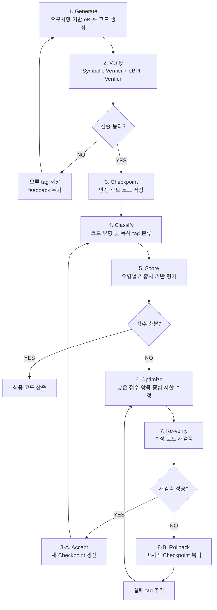
```mermaid
flowchart TD
    A[1. Generate<br/>요구사항 기반 eBPF 코드 생성] --> B[2. Verify<br/>Symbolic Verifier + eBPF Verifier]
    B --> C{검증 통과?}

    C -->|NO| D[오류 tag 저장<br/>feedback 추가]
    D --> A

    C -->|YES| E[3. Checkpoint<br/>안전 후보 코드 저장]

    E --> F[4. Classify<br/>코드 유형 및 목적 tag 분류]
    F --> G[5. Score<br/>유형별 가중치 기반 평가]

    G --> H{점수 충분?}

    H -->|YES| I[최종 코드 산출]
    H -->|NO| J[6. Optimize<br/>낮은 점수 항목 중심 제한 수정]

    J --> K[7. Re-verify<br/>수정 코드 재검증]
    K --> L{재검증 성공?}

    L -->|YES| M[8-A. Accept<br/>새 Checkpoint 갱신]
    M --> F

    L -->|NO| N[8-B. Rollback<br/>마지막 Checkpoint 복귀]
    N --> O[실패 tag 추가]
    O --> J
```

본 보고서에서 제안하는 확장 구조는 기존 Kgent 구조 위에 **검증 이후의 평가와 최적화 루프**를 추가하는 것이다.

기존 Kgent가 다음 구조였다면,

```text
요구사항
→ 코드 생성
→ verifier 통과
→ 코드 산출
```

제안 구조는 다음과 같다.

```text
요구사항
→ 코드 생성
→ verifier 통과
→ checkpoint 저장
→ 프로그램 유형 분류
→ 유형별 점수화
→ 낮은 점수 항목 개선
→ 재검증
→ accept 또는 rollback
→ 최종 코드 산출
```

이 구조의 핵심은 다음과 같다.

- verifier는 반드시 통과해야 하는 hard constraint로 둔다.
- 성능, 메모리, 코드 품질, 목적 적합성은 soft objective로 둔다.
- 안전한 후보 코드를 checkpoint로 저장한다.
- 최적화는 checkpoint 이후의 안전 후보를 대상으로만 수행한다.
- 최적화 후에는 반드시 재검증한다.
- 재검증 실패 시 마지막 안전 checkpoint로 rollback한다.

즉, 제안 구조는 Kgent의 장점인 **검증 기반 안전성**을 유지하면서,  
검증 이후의 **성능·효율·품질 개선 루프**를 추가한 구조이다.

---

# 8. 확장 구조의 단계별 상세 설명

## 8.1 Generate 단계

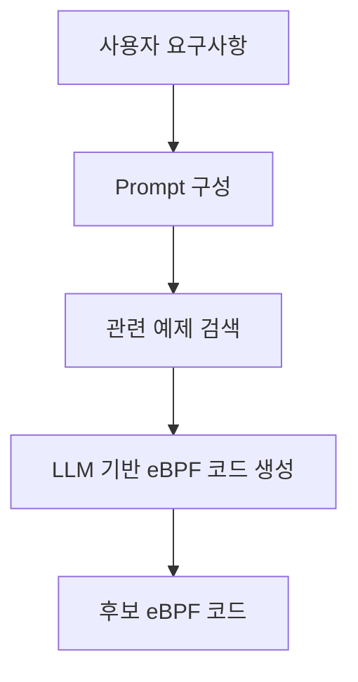
```mermaid
flowchart TD
    A[사용자 요구사항] --> B[Prompt 구성]
    B --> C[관련 예제 검색]
    C --> D[LLM 기반 eBPF 코드 생성]
    D --> E[후보 eBPF 코드]
```

Generate 단계는 기존 Kgent의 Synthesis Engine에 해당한다.

이 단계에서는 사용자의 자연어 요구사항을 기반으로 후보 eBPF 코드를 생성한다.  
다만 확장 구조에서는 단순히 코드를 생성하는 것뿐만 아니라, 이후 평가를 위해 다음 정보를 함께 기록한다.

- 요구사항 원문
- 생성된 코드
- 사용한 prompt
- 참조한 예제
- attach point 후보
- 예상 프로그램 유형
- 생성 시점
- LLM 응답 로그

이 정보를 저장하는 이유는 이후 Score나 Optimize 단계에서 코드가 왜 그렇게 생성되었는지 추적할 수 있게 하기 위해서이다.

---

## 8.2 Verify 단계

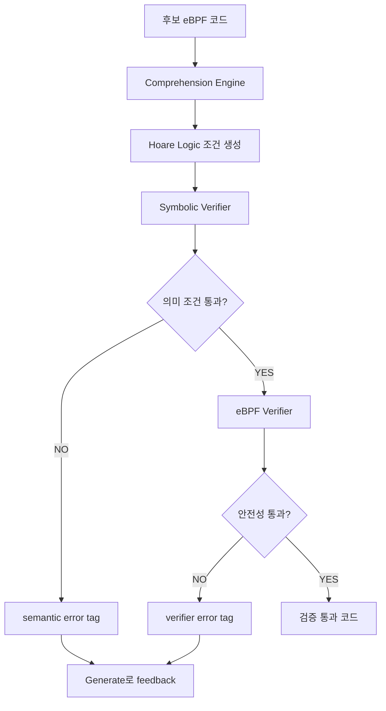
```mermaid
flowchart TD
    A[후보 eBPF 코드] --> B[Comprehension Engine]
    B --> C[Hoare Logic 조건 생성]
    C --> D[Symbolic Verifier]
    D --> E{의미 조건 통과?}

    E -->|NO| F[semantic error tag]
    F --> G[Generate로 feedback]

    E -->|YES| H[eBPF Verifier]
    H --> I{안전성 통과?}

    I -->|NO| J[verifier error tag]
    J --> G

    I -->|YES| K[검증 통과 코드]
```

Verify 단계는 두 종류의 검증을 수행한다.

첫째, Symbolic Verifier는 의미적 조건을 검사한다.  
Comprehension Engine이 생성한 `assume/assert` 조건을 기반으로, 코드가 요구사항과 의미적으로 일치하는지 확인한다.

둘째, eBPF Verifier는 커널 실행 안전성을 검사한다.  
이 단계에서는 메모리 접근, 루프 종료성, 포인터 사용, helper function 호출 등이 안전한지 확인한다.

확장 구조에서 Verify 단계의 특징은 실패 정보를 단순 문자열로 넘기는 것이 아니라, **tag 형태로 구조화**한다는 점이다.

예를 들어 다음과 같이 기록할 수 있다.

```text
tag: verifier_error
reason: invalid memory access
location: line 24
severity: hard
action: regenerate
```

또는,

```text
tag: semantic_mismatch
reason: postcondition not satisfied
location: function trace_exec
severity: hard
action: regenerate
```

이렇게 하면 이후 Optimize 단계나 Classify 단계에서도 실패 원인을 더 명확히 활용할 수 있다.

---

## 8.3 Checkpoint 단계

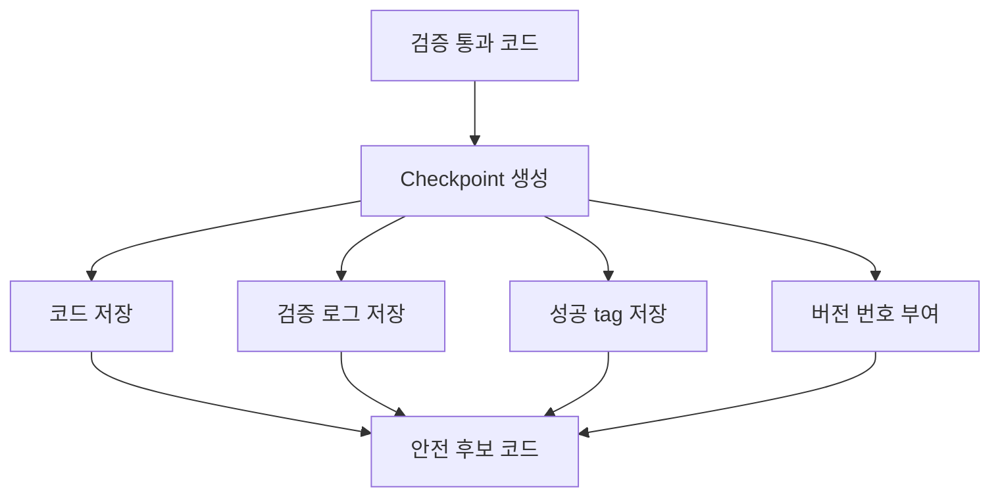
```mermaid
flowchart TD
    A[검증 통과 코드] --> B[Checkpoint 생성]
    B --> C[코드 저장]
    B --> D[검증 로그 저장]
    B --> E[성공 tag 저장]
    B --> F[버전 번호 부여]

    C --> G[안전 후보 코드]
    D --> G
    E --> G
    F --> G
```

Checkpoint는 확장 구조에서 매우 중요한 역할을 한다.

기존 Kgent 구조에서는 verifier를 통과하면 최종 코드를 산출한다.  
그러나 제안 구조에서는 verifier 통과 코드를 곧바로 최종 코드로 보지 않고, **안전 후보 코드**로 저장한다.

Checkpoint에 저장해야 할 정보는 다음과 같다.

| 저장 항목 | 설명 |
|---|---|
| code | 현재 eBPF 코드 |
| prompt | 생성에 사용된 요구사항 |
| verifier_log | Symbolic Verifier와 eBPF Verifier 결과 |
| tags | 코드 유형, 검증 결과, 실패 이력 |
| score | 현재까지의 평가 점수 |
| version | checkpoint 버전 |
| timestamp | 저장 시점 |

Checkpoint가 필요한 이유는 Optimize 단계에서 코드가 더 나빠질 수 있기 때문이다.  
최적화를 시도하다가 verifier를 통과하지 못하거나 성능이 오히려 나빠지면, 마지막으로 안전성이 확인된 checkpoint로 복귀할 수 있어야 한다.

---

## 8.4 Classify 단계

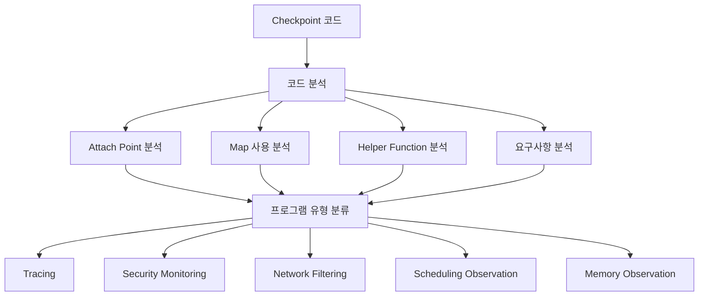
```mermaid
flowchart TD
    A[Checkpoint 코드] --> B[코드 분석]
    B --> C[Attach Point 분석]
    B --> D[Map 사용 분석]
    B --> E[Helper Function 분석]
    B --> F[요구사항 분석]

    C --> G[프로그램 유형 분류]
    D --> G
    E --> G
    F --> G

    G --> H[Tracing]
    G --> I[Security Monitoring]
    G --> J[Network Filtering]
    G --> K[Scheduling Observation]
    G --> L[Memory Observation]
```

Classify 단계는 코드가 어떤 유형의 eBPF 프로그램인지 분류한다.

이 단계가 필요한 이유는 프로그램 유형에 따라 중요한 평가 기준이 달라지기 때문이다.

예를 들어,

| 프로그램 유형 | 중요한 평가 기준 |
|---|---|
| Tracing | 관찰 정확도, 출력 정보 충분성, 낮은 오버헤드 |
| Network Filtering | 처리량, 지연 시간, packet drop 정확도 |
| Security Monitoring | 탐지 정확도, false positive 감소, 이벤트 누락 방지 |
| Scheduling Observation | 이벤트 기록 정확도, 낮은 비용, 시간 정보 정확성 |
| Memory Observation | 메모리 접근 안전성, map 사용량, 수집 정보 적절성 |

Classify 단계는 다음 정보를 기반으로 수행할 수 있다.

- 사용된 attach point
- helper function 종류
- map 사용 방식
- 출력 데이터 형태
- 요구사항의 핵심 동사  
  예: trace, count, block, filter, monitor, detect
- 코드 내 이벤트 처리 방식

---

## 8.5 Score 단계

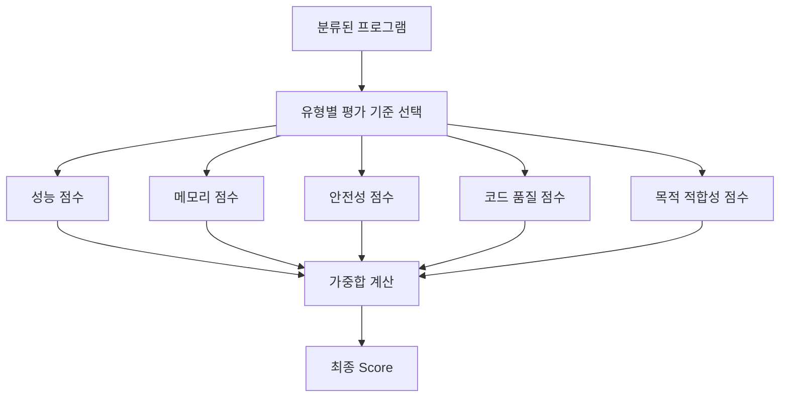
```mermaid
flowchart TD
    A[분류된 프로그램] --> B[유형별 평가 기준 선택]
    B --> C[성능 점수]
    B --> D[메모리 점수]
    B --> E[안전성 점수]
    B --> F[코드 품질 점수]
    B --> G[목적 적합성 점수]

    C --> H[가중합 계산]
    D --> H
    E --> H
    F --> H
    G --> H

    H --> I[최종 Score]
```

Score 단계는 검증을 통과한 코드가 실제로 좋은 코드인지 평가하는 단계이다.

기본 점수식은 다음과 같이 둘 수 있다.

```text
Total Score =
  w_safety  × Safety Score
+ w_perf    × Performance Score
+ w_memory  × Memory Score
+ w_quality × Code Quality Score
+ w_fit     × Requirement Fit Score
```

중요한 점은 모든 프로그램에 동일한 가중치를 적용하지 않는다는 것이다.  
Classify 단계에서 분류된 유형에 따라 가중치를 다르게 적용한다.

예를 들어 Tracing 프로그램이라면 다음과 같은 가중치를 줄 수 있다.

| 평가 항목 | 가중치 |
|---|---:|
| 목적 적합성 | 0.30 |
| 성능 오버헤드 | 0.25 |
| 안전성 | 0.20 |
| 메모리 효율 | 0.15 |
| 코드 품질 | 0.10 |

반면 Network Filtering 프로그램이라면 다음과 같이 둘 수 있다.

| 평가 항목 | 가중치 |
|---|---:|
| 처리 성능 | 0.35 |
| 목적 적합성 | 0.25 |
| 안전성 | 0.20 |
| 메모리 효율 | 0.10 |
| 코드 품질 | 0.10 |

이 구조의 장점은 평가 기준을 매번 LLM이 임의로 생성하지 않아도 된다는 점이다.  
기본 평가 기준은 사람이 고정해두고, LLM은 해당 기준에 따라 분석과 개선 후보를 제안하도록 하는 것이 더 안정적이다.

---

## 8.6 Optimize 단계

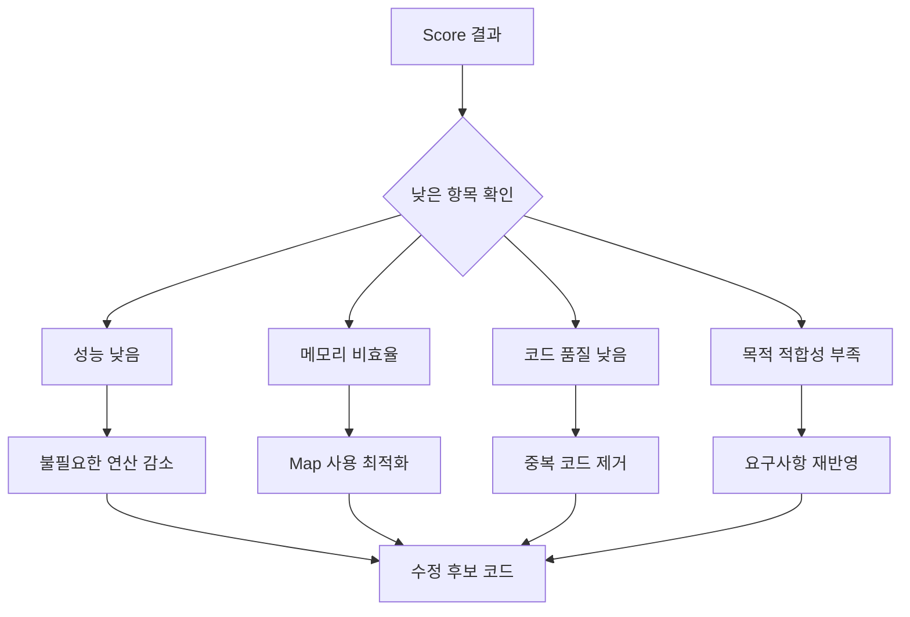
```mermaid
flowchart TD
    A[Score 결과] --> B{낮은 항목 확인}
    B --> C[성능 낮음]
    B --> D[메모리 비효율]
    B --> E[코드 품질 낮음]
    B --> F[목적 적합성 부족]

    C --> G[불필요한 연산 감소]
    D --> H[Map 사용 최적화]
    E --> I[중복 코드 제거]
    F --> J[요구사항 재반영]

    G --> K[수정 후보 코드]
    H --> K
    I --> K
    J --> K
```

Optimize 단계는 점수가 낮은 항목을 중심으로 코드를 수정한다.

중요한 점은 이 단계가 무제한적인 재작성 단계가 아니라는 것이다.  
검증을 통과한 코드를 바탕으로 제한된 범위에서 수정해야 한다.

예를 들어 다음과 같은 방식이 가능하다.

| 낮은 점수 항목 | 가능한 수정 방향 |
|---|---|
| 성능 낮음 | 불필요한 출력 제거, 조건문 단순화, hook 범위 축소 |
| 메모리 비효율 | map 크기 조정, 불필요한 key/value 저장 제거 |
| 코드 품질 낮음 | 중복 코드 제거, 변수명 명확화 |
| 목적 적합성 부족 | 요구사항과 맞지 않는 출력 필드 수정 |
| verifier margin 낮음 | 복잡한 포인터 연산 단순화, 루프 제거 |

Optimize 단계에서 가장 중요한 원칙은 다음과 같다.

```text
0순위 : verify 임계점 충족
1순위 : 각 기준*가중치
```

즉 가중합에 의해 설정된 새로운 기준들로 코드를 수정할 경우 초기의 verify 기준을 위반할 가능성이 높다.
verify 기준은 eBPF로서의 최소한의 기준을 충족시키지 못한 코드이기 때문에 각 검증에 수정->검증 형태와 검증 시 우선순위를 두어 문제를 해결한다.
따라서 수정된 코드는 반드시 Re-verify 단계를 거쳐야 한다.

---

## 8.7 Re-verify 단계

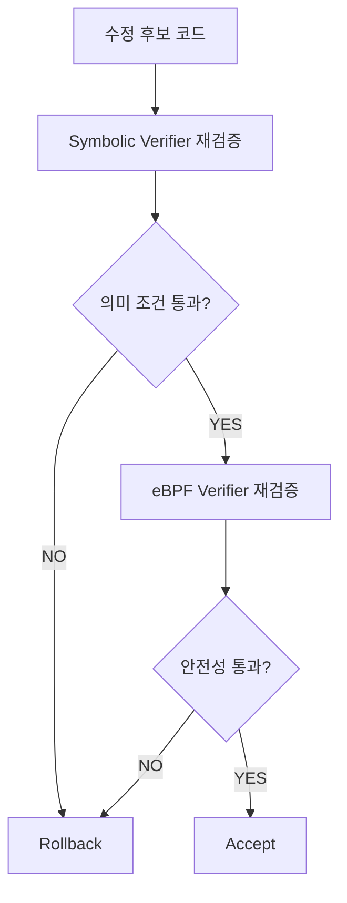
```mermaid
flowchart TD
    A[수정 후보 코드] --> B[Symbolic Verifier 재검증]
    B --> C{의미 조건 통과?}

    C -->|NO| D[Rollback]
    C -->|YES| E[eBPF Verifier 재검증]

    E --> F{안전성 통과?}

    F -->|NO| D
    F -->|YES| G[Accept]
```

Re-verify 단계는 Optimize 단계 이후 반드시 수행되어야 한다.

왜냐하면 성능 개선을 위해 수정한 코드가 기존의 안전성 조건을 깨뜨릴 수 있기 때문이다.  
특히 eBPF 프로그램은 작은 포인터 연산 변경이나 map 접근 방식 변경만으로도 verifier 실패가 발생할 수 있다.

따라서 수정 후에는 다음을 다시 확인해야 한다.

1. Symbolic verifier(의미적 조건)을 여전히 만족하는가?
2. eBPF verifier(메모리 접근 등의 최소 보안조건)를 통과하는가?
3. 성능 개선이 실제로 존재하는가?

이 단계를 통과한 코드만 새로운 checkpoint로 승격될 수 있다.

---

## 8.8 Rollback or Accept 단계

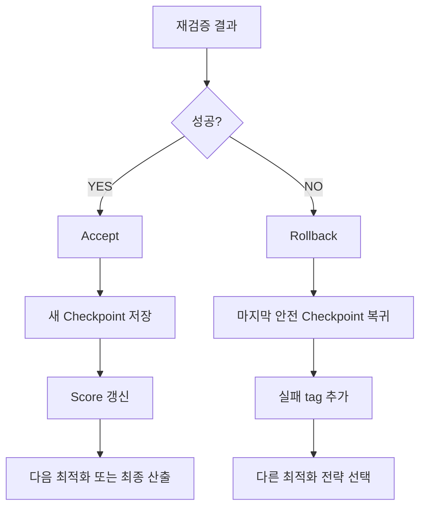
```mermaid
flowchart TD
    A[재검증 결과] --> B{성공?}

    B -->|YES| C[Accept]
    C --> D[새 Checkpoint 저장]
    D --> E[Score 갱신]
    E --> F[다음 최적화 또는 최종 산출]

    B -->|NO| G[Rollback]
    G --> H[마지막 안전 Checkpoint 복귀]
    H --> I[실패 tag 추가]
    I --> J[다른 최적화 전략 선택]
```

Accept는 수정된 코드가 기존 checkpoint보다 더 나은 코드라고 판단될 때 수행한다.  
이 경우 새 코드는 새로운 checkpoint로 저장된다.

Rollback은 수정된 코드가 verifier를 통과하지 못하거나, 점수가 더 낮아졌거나, 목적 적합성을 해친 경우 수행한다.

Rollback 구조가 있으면 시스템은 공격적인 최적화를 시도하면서도 안전성을 유지할 수 있다.

즉, 확장 구조는 다음 원칙을 따른다.

```text
검증된 코드만 checkpoint로 저장한다.
검증되지 않은 코드는 최종 산출물이 될 수 없다.
수정 실패 시 항상 마지막 안전 상태로 돌아간다.
```

---

# 9. Tag 기반 분류와 유형별 가중치 평가

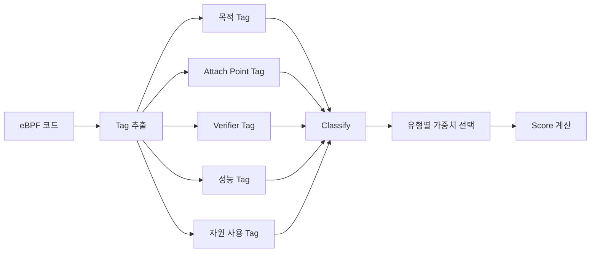
```mermaid
flowchart LR
    A[eBPF 코드] --> B[Tag 추출]
    B --> C[목적 Tag]
    B --> D[Attach Point Tag]
    B --> E[Verifier Tag]
    B --> F[성능 Tag]
    B --> G[자원 사용 Tag]

    C --> H[Classify]
    D --> H
    E --> H
    F --> H
    G --> H

    H --> I[유형별 가중치 선택]
    I --> J[Score 계산]
```

Tag는 확장 구조에서 매우 중요한 역할을 한다.  
단순히 코드만 보고 평가하는 것이 아니라, 코드의 목적과 특성을 구조화된 정보로 저장하기 때문이다.

## 9.1 Tag 예시

| Tag 종류 | 예시 |
|---|---|
| 목적 tag | tracing, filtering, monitoring, profiling, security |
| attach point tag | kprobe, tracepoint, xdp, socket, syscall |
| verifier tag | passed, memory_error, loop_error, pointer_error |
| 성능 tag | high_overhead, low_overhead, frequent_event |
| 자원 tag | map_heavy, stack_sensitive, helper_heavy |
| 최적화 tag | reduce_map_access, simplify_condition, reduce_output |

## 9.2 Tag 기반 평가의 장점

Tag를 사용하면 다음과 같은 장점이 있다.

첫째, 실패 원인을 재사용할 수 있다.  
예를 들어 `pointer_error` tag가 붙은 코드는 다음 수정에서 포인터 연산을 줄이는 방향으로 개선할 수 있다.

둘째, 프로그램 유형별로 다른 평가 기준을 적용할 수 있다.  
`xdp` tag가 붙은 프로그램은 지연 시간과 처리량을 더 중요하게 보고, `tracing` tag가 붙은 프로그램은 관찰 정보의 정확성과 오버헤드를 더 중요하게 볼 수 있다.

셋째, LLM이 매번 기준을 임의로 만드는 것을 방지할 수 있다.  
기준은 사람이 설계하고, LLM은 그 기준 안에서 분석하도록 제한할 수 있다.

---

# 10. 기존 Kgent 구조와 확장 구조 비교

```mermaid
flowchart LR
    subgraph 기존_Kgent[기존 Kgent 구조]
        A1[요구사항] --> A2[코드 생성]
        A2 --> A3[Comprehension]
        A3 --> A4[Symbolic Verifier]
        A4 --> A5[eBPF Verifier]
        A5 --> A6[최종 코드]
    end

    subgraph 확장_구조[제안 확장 구조]
        B1[요구사항] --> B2[코드 생성]
        B2 --> B3[검증]
        B3 --> B4[Checkpoint]
        B4 --> B5[Classify]
        B5 --> B6[Score]
        B6 --> B7[Optimize]
        B7 --> B8[Re-verify]
        B8 --> B9[Accept or Rollback]
        B9 --> B10[최종 코드]
    end
```

| 비교 항목 | 기존 Kgent 구조 | 제안 확장 구조 |
|---|---|---|
| 핵심 목표 | 자연어 기반 eBPF 코드 생성 및 검증 | 검증된 코드의 성능·효율·품질까지 반복 개선 |
| 주요 검증 | Symbolic Verifier, eBPF Verifier | 기존 검증 + 재검증 |
| 실패 처리 | 오류 메시지를 Prompter로 feedback | 오류 tag 저장 후 재생성 또는 rollback |
| 성능 평가 | 명시적 핵심 단계는 아님 | Score 단계에서 평가 |
| 코드 유형 분류 | 제한적 | Classify 단계에서 유형별 분류 |
| 최적화 | verifier 실패 수정 중심 | 점수 기반 제한적 최적화 |
| 안정성 유지 | verifier 통과 여부 중심 | checkpoint와 rollback으로 안전 상태 유지 |
| 최종 산출물 | verifier-safe eBPF 코드 | verifier-safe + score-improved eBPF 코드 |

---

# 11. 구현 방향성

```mermaid
flowchart TD
    A[1단계: 실험 환경 구성] --> B[2단계: Kgent 구조 분석 및 모사]
    B --> C[3단계: 간단한 eBPF 코드 생성 실험]
    C --> D[4단계: Verifier 결과 수집]
    D --> E[5단계: Checkpoint 저장 구조 구현]
    E --> F[6단계: Tag 기반 Classify 구현]
    F --> G[7단계: Score 계산 구현]
    G --> H[8단계: Optimize Prompt 설계]
    H --> I[9단계: Re-verify 및 Rollback 구현]
    I --> J[10단계: 결과 비교 및 보고서 작성]
```

## 11.1 Linux 기반 실제 eBPF 실험 방향

실제 eBPF를 사용하려면 Linux 환경이 필요하다.  
이 경우 다음 도구를 활용할 수 있다.

- bpftrace
- libbpf
- clang/LLVM
- bpftool
- Linux eBPF verifier
- Python 기반 자동화 스크립트
- LLM API 또는 로컬 LLM


## 11.2 xv6 기반 축소 실험 방향

xv6는 실제 Linux eBPF 환경을 그대로 제공하지 않는다.  
따라서 xv6에서는 실제 eBPF verifier를 구현하기보다는, eBPF와 유사한 “제한된 커널 확장 코드” 또는 “OS 동작 관찰 코드”를 대상으로 축소 실험을 할 수 있다.

예를 들어 다음과 같은 방식이 가능하다.

```text
xv6 시스템 콜 또는 스케줄러 이벤트 관찰
→ LLM이 간단한 관찰 코드 제안
→ 정적 검사기로 위험한 코드 패턴 검사
→ 실행 로그 수집
→ 오버헤드 측정
→ 점수화
→ 개선안 생성
→ 재검사
```

xv6 실험의 의미는 실제 eBPF 완전 구현이 아니라,  
**생성 → 검증 → 평가 → 개선 → 재검증**이라는 구조적 가능성을 작은 OS 환경에서 검증하는 것이다.

---

# 12. 평가 시나리오 예시

```mermaid
flowchart TD
    A[평가 대상 eBPF 프로그램] --> B[Tracing 프로그램]
    A --> C[Network Filtering 프로그램]
    A --> D[Security Monitoring 프로그램]
    A --> E[Scheduling Observation 프로그램]

    B --> F[오버헤드 / 출력 정확성 평가]
    C --> G[처리량 / 지연 시간 평가]
    D --> H[탐지 정확도 / false positive 평가]
    E --> I[이벤트 누락 / 기록 비용 평가]
```

## 12.1 Tracing 프로그램 평가

예시 요구사항:

```text
프로세스가 execve를 호출할 때 PID와 command name을 출력하라.
```

평가 기준:

| 항목 | 설명 |
|---|---|
| 목적 적합성 | PID와 command name을 정확히 출력하는가 |
| 오버헤드 | 이벤트당 실행 비용이 낮은가 |
| 출력 품질 | 불필요한 출력이 없는가 |
| verifier 통과 | 안전하게 실행 가능한가 |
| 코드 단순성 | 불필요한 map이나 복잡한 조건이 없는가 |

## 12.2 Network Filtering 프로그램 평가

예시 요구사항:

```text
특정 포트로 들어오는 패킷을 카운트하거나 차단하라.
```

평가 기준:

| 항목 | 설명 |
|---|---|
| 처리량 | 많은 패킷을 빠르게 처리하는가 |
| 지연 시간 | packet path에 추가되는 비용이 낮은가 |
| 정확성 | 지정한 포트만 처리하는가 |
| map 효율 | 불필요한 상태 저장이 없는가 |
| verifier 통과 | 안전하게 실행 가능한가 |

## 12.3 Security Monitoring 프로그램 평가

예시 요구사항:

```text
짧은 시간 안에 많은 fork를 호출하는 프로세스를 감지하라.
```

평가 기준:

| 항목 | 설명 |
|---|---|
| 탐지 정확도 | 의심 프로세스를 잘 감지하는가 |
| false positive | 정상 프로세스를 공격으로 오탐하지 않는가 |
| 상태 관리 | 프로세스별 카운터를 효율적으로 저장하는가 |
| 오버헤드 | 빈번한 이벤트에서도 부담이 낮은가 |
| verifier 통과 | 안전하게 실행 가능한가 |

---

# 13. 기대 효과

```mermaid
flowchart LR
    A[Kgent 기반 구조] --> B[자연어 기반 eBPF 생성]
    B --> C[Verifier 기반 안전성 확보]
    C --> D[Checkpoint 기반 안전 후보 저장]
    D --> E[Score 기반 품질 평가]
    E --> F[Optimize 기반 개선]
    F --> G[Re-verify 기반 안전성 유지]
    G --> H[OS 개발 보조 시스템]
```

제안 구조의 기대 효과는 다음과 같다.

첫째, 단순 코드 생성이 아니라 검증 가능한 코드 생성을 목표로 한다.  
LLM이 생성한 코드를 그대로 신뢰하지 않고, verifier를 통해 안전성을 확인한다.

둘째, 검증 이후의 품질 개선을 포함한다.  
기존 Kgent 구조가 verifier-safe 코드 생성에 초점을 맞춘다면, 제안 구조는 성능과 효율성까지 고려한다.

셋째, rollback을 통해 안전성을 유지한다.  
최적화가 실패하더라도 마지막 안전 checkpoint로 돌아갈 수 있으며 같은 이유로 과감한 변경이 가능하다.

넷째, OS 개발 학습과 연구에 활용할 수 있다.  
이 구조는 실제 Linux eBPF 환경뿐 아니라, xv6와 같은 교육용 OS에서도 축소된 형태로 실험할 수 있다.

다섯째, LLM 기반 OS 개발 보조 시스템의 확장 가능성을 보여준다.  
단순히 “AI가 코드를 작성한다”가 아니라, “AI가 생성한 코드를 검증하고, 평가하고, 개선하는 구조”를 설계한다는 점에서 연구적 의미가 있다.

---

# 14. 결론

```mermaid
flowchart TD
    A[기존 Kgent] --> B[자연어 요구사항 기반 eBPF 코드 생성]
    B --> C[Symbolic Verifier와 eBPF Verifier로 검증]
    C --> D[verifier-safe 코드 산출]

    D --> E[제안 확장]
    E --> F[Checkpoint 저장]
    F --> G[Classify]
    G --> H[Score]
    H --> I[Optimize]
    I --> J[Re-verify]
    J --> K[Rollback or Accept]

    K --> L[검증 기반 심층 최적화 구조]
```

Kgent는 자연어 요구사항을 eBPF 코드로 변환하고, LLM 기반 program comprehension, symbolic execution, eBPF verifier, feedback loop를 결합하여 안전한 커널 확장 프로그램을 생성하려는 구조이다.

그러나 실제 OS 개발에서는 verifier를 통과하는 것만으로 충분하지 않다.  
검증된 코드가 실제로 효율적인지, 목적에 적합한지, 운영 환경에서 오버헤드가 낮은지까지 평가해야 한다.

이를 개선한 **Kgent 기반 검증 심층구조**는 단순한 eBPF 코드 생성기를 넘어,  
OS 개발을 보조하는 지능형 검증·평가·최적화 시스템으로 확장 될 수 있는지를 확인한다.
