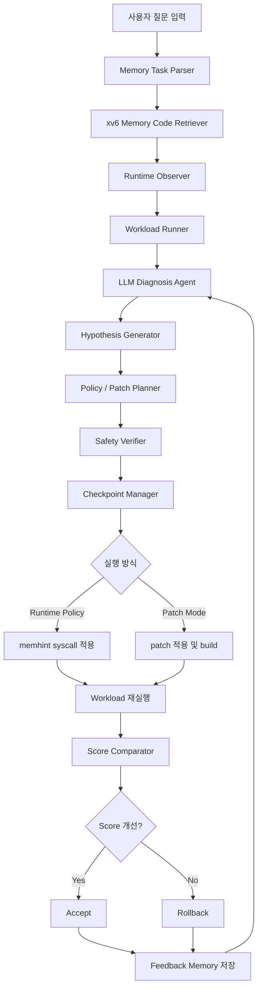

# OS를 위한 LLM: xv6 메모리 진단·검증·개선 Agent Pipeline 구현 설계

## 0. 문서 목적

이 문서는 `xv6-riscv` 환경에서 **LLM을 활용한 메모리 관리 보조 시스템**을 설계하고 구현하기 위한 상세 문서이다.

본 프로젝트의 핵심은 단순히 LLM API에 메모리 상태를 넣고 `kill`, `quota`, `swap`, `noop` 중 하나를 고르게 하는 것이 아니다.  
그러한 구조는 사실상 정책 분류기 또는 rule-based controller와 크게 다르지 않다.

따라서 본 프로젝트는 LLM을 다음과 같은 역할로 확장한다.

```text
사용자 질문 해석
→ 관련 xv6 메모리 코드 선택
→ 런타임 메모리 상태 수집
→ workload 실행
→ 원인 가설 생성
→ 개선 정책 또는 patch 후보 생성
→ verifier 검사
→ checkpoint 저장
→ 재실험
→ score 비교
→ accept / rollback
→ 실패·성공 feedback 저장
```

즉, 본 프로젝트는 새로운 LLM 모델 자체를 학습하는 것이 아니라, 기존 LLM API를 xv6 메모리 관리 환경에 연결하고, 검증 구조와 실험 루프를 결합한 **LLM 기반 OS 메모리 관리 agent pipeline**을 구현하는 것을 목표로 한다.

---

## 1. 프로젝트 핵심 목표

### 1.1 최종 목표

```text
xv6의 메모리 상태와 관련 커널 코드를 LLM이 분석하고,
메모리 부족 원인과 개선 후보를 제안하며,
제안된 정책 또는 patch를 verifier와 workload 실험으로 검증한 뒤,
효과가 있으면 accept하고 문제가 있으면 rollback하는 시스템을 만든다.
```

### 1.2 단순 LLM API 사용과의 차이

#### 약한 구조

```text
메모리 상태 입력
↓
LLM API 호출
↓
quota / kill / swap / noop 선택
```

이 구조는 거의 분류기와 비슷하다.

#### 본 프로젝트 구조

```text
사용자 질문
↓
문제 유형 분석
↓
관련 xv6 코드 선택
↓
메모리 상태 수집
↓
workload 실행
↓
LLM 원인 진단
↓
가설 생성
↓
정책 또는 patch 후보 생성
↓
verifier 검사
↓
checkpoint 저장
↓
재실험
↓
score 비교
↓
accept / rollback
↓
feedback memory 저장
```

이 구조에서는 LLM이 단순 action 선택기가 아니라, **분석기, 진단기, 실험 설계자, 개선 제안자, 결과 해석자**의 역할을 수행한다.

---

## 2. 전체 시스템 구조

### 2.1 전체 흐름



### 2.2 구성 요소

| 구성 요소 | 위치 | 역할 |
|---|---|---|
| `memhint.c` | `user/` | xv6 내부에서 메모리 상태를 수집하고 LLM 응답을 적용 |
| `getmemstat` syscall | `kernel/` | 전체 메모리 상태 제공 |
| `proclist` 확장 | `kernel/` | 프로세스별 메모리 사용량 제공 |
| `bridge.py` | `bridge/` | xv6와 LLM API 사이의 통신 중계 |
| `llm_agent.py` | `host/agent/` | LLM 분석, 가설 생성, 정책/patch 생성 |
| `verifier.py` | `host/verifier/` | LLM 응답 및 patch 안전성 검사 |
| `checkpoint.py` | `host/checkpoint/` | 적용 전후 상태 저장 및 rollback |
| `workload_runner.py` | `host/eval/` | xv6 workload 실행 및 로그 수집 |
| `score.py` | `host/eval/` | 실험 결과 점수화 |
| `feedback_memory.jsonl` | `host/memory/` | 실패/성공 기록 저장 |

---

## 3. 권장 Repository 구조

```text
OS_LLM_MEMORY_AGENT/
├── xv6-riscv/
│   ├── kernel/
│   │   ├── kalloc.c
│   │   ├── vm.c
│   │   ├── trap.c
│   │   ├── proc.c
│   │   ├── proc.h
│   │   ├── sysproc.c
│   │   ├── syscall.c
│   │   ├── syscall.h
│   │   ├── memstat.h          # 신규
│   │   ├── swap.c             # 심화/선택
│   │   └── swap.h             # 심화/선택
│   │
│   ├── user/
│   │   ├── memhint.c          # 신규
│   │   ├── memstress.c        # 신규 workload
│   │   ├── pagefaulttest.c    # 신규 workload
│   │   ├── shelllat.c         # 신규 workload
│   │   └── user.h
│   │
│   └── Makefile
│
├── bridge/
│   ├── bridge.py
│   └── prompts/
│       ├── mem_diagnosis.txt
│       ├── mem_policy.txt
│       ├── mem_patch.txt
│       └── mem_reflection.txt
│
├── host/
│   ├── agent/
│   │   ├── llm_agent.py
│   │   ├── task_parser.py
│   │   ├── code_retriever.py
│   │   ├── diagnosis_agent.py
│   │   ├── hypothesis_agent.py
│   │   └── planner_agent.py
│   │
│   ├── verifier/
│   │   ├── verifier.py
│   │   ├── action_schema.py
│   │   ├── patch_guard.py
│   │   └── safety_rules.py
│   │
│   ├── checkpoint/
│   │   ├── checkpoint.py
│   │   ├── rollback.py
│   │   └── metadata.py
│   │
│   ├── eval/
│   │   ├── workload_runner.py
│   │   ├── score.py
│   │   ├── parser.py
│   │   └── report_generator.py
│   │
│   └── memory/
│       ├── feedback_memory.jsonl
│       └── experiment_history.jsonl
│
├── checkpoints/
│   ├── ckpt_001_baseline/
│   ├── ckpt_002_getmemstat/
│   ├── ckpt_003_quota/
│   └── ...
│
├── reports/
│   ├── design.md
│   ├── experiment_result.md
│   └── final_report.md
│
└── README.md
```

---

## 4. xv6 메모리 관리 배경

### 4.1 xv6 기본 메모리 구조

xv6의 메모리 관리는 비교적 단순하다.

| 파일 | 역할 |
|---|---|
| `kernel/kalloc.c` | 물리 페이지 할당 및 해제 |
| `kernel/vm.c` | 가상 메모리, 페이지 테이블, `uvmalloc`, `uvmdealloc`, `mappages` |
| `kernel/trap.c` | user trap, page fault 처리 |
| `kernel/proc.h` | `struct proc`, 프로세스 크기 `sz` |
| `kernel/sysproc.c` | `sbrk`, `sleep`, `kill` 등 syscall 구현 |
| `kernel/memlayout.h` | 커널/물리 메모리 주소 배치 |
| `kernel/riscv.h` | PTE flag, SATP, scause 등 RISC-V 관련 정의 |

### 4.2 xv6 기본 구조의 한계

xv6는 교육용 OS이므로 다음과 같은 고급 메모리 관리 기능이 기본적으로 없다.

```text
1. 프로세스별 memory quota 없음
2. OOM killer 없음
3. swap 없음
4. page fault 통계 없음
5. kalloc 실패 통계 없음
6. 프로세스별 resident page 추적 없음
7. 메모리 압박 상황에서의 정책 판단 계층 없음
```

이 프로젝트는 이러한 한계를 이용하여 LLM이 메모리 상태를 분석하고, 정책 또는 코드 개선 후보를 제안할 수 있는 실험 환경을 만든다.

---

## 5. LLM의 역할 정의

### 5.1 LLM이 하지 않는 일

LLM은 다음을 직접 수행하지 않는다.

```text
1. 커널 메모리를 직접 수정하지 않는다.
2. page fault handler 내부에서 실시간 판단하지 않는다.
3. 검증 없이 patch를 main branch에 반영하지 않는다.
4. init, shell 등 핵심 프로세스를 임의로 kill하지 않는다.
5. verifier를 우회하지 않는다.
```

### 5.2 LLM이 수행하는 일

LLM은 다음 역할을 맡는다.

```text
1. 사용자 질문을 메모리 관리 문제로 구조화
2. 관련 xv6 코드 선택
3. 런타임 메모리 상태 해석
4. workload 결과 분석
5. 문제 원인 가설 생성
6. quota / kill / swap / patch 후보 비교
7. 안전한 개선 계획 작성
8. verifier 실패 원인 해석
9. score 변화 분석
10. feedback memory를 바탕으로 다음 시도 조정
```

### 5.3 LLM 출력은 반드시 구조화한다

LLM이 자유 문장만 출력하면 자동화가 어렵다.  
따라서 모든 출력은 다음 중 하나의 JSON schema로 제한한다.

```text
1. diagnosis schema
2. hypothesis schema
3. runtime policy schema
4. patch proposal schema
5. reflection schema
```

---

## 6. 단계별 구현 계획

---

# Phase 0. Baseline 준비

## 6.1 목표

기본 xv6가 정상적으로 빌드되고 실행되는 상태를 만든다.

## 6.2 작업

```text
1. xv6-riscv clone
2. qemu 실행 확인
3. 기존 syscall 번호 확인
4. 기존 user program 추가 방식 확인
5. baseline checkpoint 저장
```

## 6.3 명령 예시

```bash
git clone https://github.com/mit-pdos/xv6-riscv.git
cd xv6-riscv
make qemu
```

## 6.4 완료 조건

```text
make qemu 실행 성공
xv6 shell 진입 성공
기본 명령어 ls, echo, cat 실행 가능
baseline checkpoint 생성
```

## 6.5 checkpoint

```text
checkpoints/ckpt_001_baseline/
```

---

# Phase 1. Memory Observation 구현

## 7.1 목표

LLM이 분석할 수 있도록 xv6 내부 메모리 상태를 수집한다.

## 7.2 추가할 정보

```text
1. 전체 메모리 크기
2. free memory 크기
3. used memory 크기
4. 프로세스별 pid
5. 프로세스 이름
6. 프로세스 상태
7. 프로세스 sz
8. page fault count
9. sbrk call count
10. kalloc fail count
```

처음 구현에서는 `1~7`까지만 필수로 하고, `8~10`은 확장 지표로 둔다.

---

## 7.3 `kernel/memstat.h` 추가

```c
#ifndef XV6_MEMSTAT_H
#define XV6_MEMSTAT_H

struct memstat {
  uint64 total_memory;
  uint64 free_memory;
  uint64 used_memory;
  uint64 kalloc_fail_count;
  uint64 page_fault_count;
};

#endif
```

---

## 7.4 `kalloc.c`에서 free page 계산

xv6의 `kalloc.c`는 free list를 사용한다.  
free memory를 구하려면 free list에 남아 있는 page 개수를 세면 된다.

### 개념

```text
freelist에 남은 page 수 × PGSIZE = free_memory
```

### 구현 방향

```c
uint64
freemem(void)
{
  struct run *r;
  uint64 n = 0;

  acquire(&kmem.lock);
  r = kmem.freelist;
  while(r){
    n++;
    r = r->next;
  }
  release(&kmem.lock);

  return n * PGSIZE;
}
```

### 필요 선언

`defs.h`에 추가한다.

```c
uint64 freemem(void);
```

---

## 7.5 `sys_getmemstat` 구현

`kernel/sysproc.c`에 syscall을 추가한다.

```c
uint64
sys_getmemstat(void)
{
  uint64 addr;
  struct memstat ms;

  argaddr(0, &addr);

  ms.total_memory = PHYSTOP - KERNBASE;
  ms.free_memory = freemem();
  ms.used_memory = ms.total_memory - ms.free_memory;
  ms.kalloc_fail_count = get_kalloc_fail_count();
  ms.page_fault_count = get_page_fault_count();

  if(copyout(myproc()->pagetable, addr, (char *)&ms, sizeof(ms)) < 0)
    return -1;

  return 0;
}
```

초기 구현에서는 `kalloc_fail_count`, `page_fault_count`를 0으로 두어도 된다.

---

## 7.6 syscall 번호 추가

`kernel/syscall.h`

```c
#define SYS_getmemstat 27
```

`kernel/syscall.c`

```c
extern uint64 sys_getmemstat(void);

static uint64 (*syscalls[])(void) = {
  ...
  [SYS_getmemstat] sys_getmemstat,
};
```

`user/user.h`

```c
struct memstat;
int getmemstat(struct memstat *);
```

`user/usys.pl`

```perl
entry("getmemstat");
```

---

## 7.7 `proclist` 확장

기존 `proclist`가 있다면 `proc_info` 구조체에 `sz`를 추가한다.

예시:

```c
struct proc_info {
  int pid;
  int state;
  int priority;
  uint64 sz;
  char name[16];
};
```

커널에서 프로세스 정보를 복사할 때:

```c
info.sz = p->sz;
```

이렇게 하면 프로세스별 메모리 사용량을 LLM에 전달할 수 있다.

---

## 7.8 `user/memhint.c` 1차 구현

### 역할

```text
1. getmemstat 호출
2. proclist 호출
3. 메모리 상태를 출력
4. bridge.py가 읽을 수 있는 형식으로 출력
```

### 출력 형식

```text
<<MEM>>
total=134217728 free=52428800 used=81788928 kalloc_fail=0 page_fault=0
pid name state sz priority
1 init SLEEPING 16384 10
2 sh RUNNING 32768 10
3 memstress RUNNABLE 8388608 10
<<MEM_END>>
```

### 개념 코드

```c
#include "kernel/types.h"
#include "kernel/stat.h"
#include "kernel/memstat.h"
#include "user/user.h"

int
main(int argc, char **argv)
{
  struct memstat ms;

  if(getmemstat(&ms) < 0){
    fprintf(2, "getmemstat failed\n");
    exit(1);
  }

  printf("<<MEM>>\n");
  printf("total=%l free=%l used=%l kalloc_fail=%l page_fault=%l\n",
         ms.total_memory,
         ms.free_memory,
         ms.used_memory,
         ms.kalloc_fail_count,
         ms.page_fault_count);

  /*
   * proclist가 구현되어 있다면 여기서 프로세스 목록 출력
   */

  printf("<<MEM_END>>\n");

  exit(0);
}
```

---

## 7.9 Phase 1 완료 조건

```text
1. xv6에서 memhint 실행 가능
2. 전체 free memory 출력 가능
3. 프로세스별 sz 출력 가능
4. bridge.py가 <<MEM>> 블록을 인식 가능
5. LLM에게 메모리 상태를 전달 가능
```

---

# Phase 2. Bridge와 LLM Diagnosis 연결

## 8.1 목표

xv6에서 출력한 `<<MEM>>` 블록을 host의 `bridge.py`가 읽고, LLM에게 전달하여 진단 보고서를 생성한다.

---

## 8.2 `bridge.py` 프로토콜

### 입력

```text
<<MEM>>
total=134217728 free=52428800 used=81788928 kalloc_fail=0 page_fault=0
pid name state sz priority
1 init SLEEPING 16384 10
2 sh RUNNING 32768 10
3 memstress RUNNABLE 8388608 10
<<MEM_END>>
```

### 출력

초기에는 정책 적용 없이 진단만 출력한다.

```json
{
  "type": "diagnosis",
  "summary": "Memory pressure is moderate.",
  "risk_level": "medium",
  "main_cause": "pid 3 memstress uses the largest memory region.",
  "evidence": [
    "free memory is 39%",
    "pid 3 sz is 8MB"
  ],
  "recommended_next_step": "run memstress with higher pressure and collect page fault count"
}
```

---

## 8.3 `bridge.py` 흐름

```python
def handle_mem_block(mem_text: str) -> str:
    parsed = parse_mem_text(mem_text)

    prompt = build_mem_diagnosis_prompt(parsed)

    llm_result = call_llm(prompt)

    verified = verify_diagnosis_schema(llm_result)

    return json.dumps(verified)
```

---

## 8.4 Prompt 구성

`bridge/prompts/mem_diagnosis.txt`

```text
You are an OS memory diagnosis agent for xv6-riscv.

You will receive:
1. xv6 memory statistics
2. process list
3. optional workload logs
4. optional previous feedback memory

Your job is not to directly modify the kernel.
Your job is to diagnose the memory problem, explain the cause, and suggest the safest next step.

You must output valid JSON only.

Required JSON schema:
{
  "type": "diagnosis",
  "summary": "...",
  "risk_level": "low|medium|high|critical",
  "main_cause": "...",
  "evidence": ["..."],
  "related_components": ["kalloc.c", "vm.c", "trap.c", "proc.c"],
  "recommended_next_step": "..."
}
```

---

## 8.5 Phase 2 완료 조건

```text
1. memhint 출력이 bridge.py로 전달됨
2. bridge.py가 <<MEM>> 블록을 파싱함
3. LLM이 diagnosis JSON을 반환함
4. JSON schema 검증 통과
5. xv6 또는 host console에서 진단 결과 확인 가능
```

---

# Phase 3. Workload Runner 구현

## 9.1 목표

LLM이 단순 상태만 보는 것이 아니라, workload 실행 결과를 기반으로 판단하게 한다.

---

## 9.2 필요한 workload

### 9.2.1 `memstress.c`

메모리를 계속 요청하는 프로그램.

```text
목적:
sbrk를 반복 호출하여 메모리 압박 상황을 만든다.
```

동작:

```text
1. sbrk(PGSIZE)를 반복 호출
2. 할당된 주소에 실제 write 수행
3. page fault와 실제 물리 페이지 할당 유도
4. 일정 시간 sleep
```

### 9.2.2 `pagefaulttest.c`

Lazy allocation과 page fault 횟수를 관찰하는 프로그램.

```text
목적:
sbrk 이후 실제 접근 시 page fault가 발생하는지 확인한다.
```

### 9.2.3 `shelllat.c`

메모리 압박 중 shell 응답성을 측정하는 프로그램.

```text
목적:
메모리 정책 적용 전후 사용자 응답성이 좋아지는지 확인한다.
```

### 9.2.4 `multimem.c`

여러 프로세스가 동시에 메모리를 요청하는 프로그램.

```text
목적:
특정 프로세스가 메모리를 독점하는지, fairness가 유지되는지 확인한다.
```

---

## 9.3 Host workload runner

`host/eval/workload_runner.py`

### 역할

```text
1. xv6 실행
2. workload 명령 입력
3. memhint 실행
4. 출력 로그 저장
5. timeout 관리
6. 결과 파일 생성
```

### 결과 예시

```json
{
  "workload": "memstress_x4",
  "before": {
    "free_memory_min": 8388608,
    "oom_count": 3,
    "shell_latency_ms": 420,
    "survived_process": 5,
    "total_process": 10
  },
  "after": {
    "free_memory_min": 25165824,
    "oom_count": 1,
    "shell_latency_ms": 180,
    "survived_process": 8,
    "total_process": 10
  }
}
```

---

## 9.4 Phase 3 완료 조건

```text
1. memstress 실행 가능
2. workload 실행 로그 수집 가능
3. memhint와 workload 결과를 함께 LLM에게 전달 가능
4. baseline 실험 결과 저장 가능
```

---

# Phase 4. Hypothesis Generator 구현

## 10.1 목표

LLM이 바로 action을 선택하지 않고, 먼저 원인 가설을 생성하게 한다.

---

## 10.2 왜 가설 단계가 필요한가?

가설 단계가 없으면 LLM은 단순히 다음처럼 동작한다.

```text
free memory 낮음
→ 가장 큰 프로세스 kill
```

하지만 이는 지나치게 단순하다.

가설 단계가 있으면 다음과 같은 분석이 가능하다.

```text
가설 1:
pid 5가 메모리를 많이 사용하지만, shell latency에 직접 영향을 주는지는 아직 불명확하다.

가설 2:
OOM의 원인은 전체 메모리 부족이 아니라 lazy allocation 이후 page fault 시점의 kalloc 실패일 수 있다.

가설 3:
swapout은 OOM을 줄일 수 있지만, swapin이 잦으면 shell latency가 악화될 수 있다.

가설 4:
kill은 즉각적이지만 사용자 프로그램을 종료시키므로 최후 수단이어야 한다.
```

---

## 10.3 Hypothesis JSON Schema

```json
{
  "type": "hypothesis",
  "hypotheses": [
    {
      "id": "H1",
      "claim": "The main memory pressure is caused by pid 5 repeatedly calling sbrk.",
      "evidence": [
        "pid 5 has the largest sz",
        "free memory decreases after memstress starts"
      ],
      "test_plan": "Run memstress with page fault counter enabled.",
      "expected_result": "pid 5 page_fault_count increases rapidly."
    }
  ],
  "preferred_hypothesis": "H1"
}
```

---

## 10.4 Prompt

`bridge/prompts/mem_hypothesis.txt`

```text
You are an xv6 memory hypothesis generator.

Given:
- user question
- memory stats
- process list
- workload logs
- previous feedback memory

Generate 2 to 4 possible hypotheses about the root cause.
Do not choose an action yet.
For each hypothesis, include:
- claim
- evidence
- test plan
- expected result

Return valid JSON only.
```

---

## 10.5 Phase 4 완료 조건

```text
1. LLM이 최소 2개 이상의 원인 가설 생성
2. 각 가설에 evidence와 test_plan 포함
3. 다음 실험 또는 정책 선택이 가설에 기반함
```

---

# Phase 5. Runtime Policy Mode 구현

## 11.1 목표

코드 수정 없이 syscall로 적용 가능한 정책을 LLM이 제안하고, memhint가 검증 후 적용한다.

---

## 11.2 Runtime Policy 종류

| action | 의미 | 위험도 |
|---|---|---|
| `noop` | 아무것도 하지 않음 | 낮음 |
| `quota` | 특정 pid의 메모리 사용량 제한 | 중간 |
| `kill` | 특정 pid 종료 | 높음 |
| `swapout` | 특정 pid의 일부 페이지를 swap out | 높음 |
| `protect` | 특정 pid를 보호 대상으로 지정 | 낮음 |

초기 구현에서는 `noop`, `quota`, `kill`만 구현하고, `swapout`은 심화 단계로 둔다.

---

## 11.3 Runtime Policy JSON Schema

```json
{
  "type": "runtime_policy",
  "action": "quota",
  "pid": 5,
  "bytes": 16777216,
  "reason": "pid 5 dominates memory usage but killing it is too aggressive.",
  "risk": "medium",
  "expected_effect": "reduce memory growth of pid 5 and preserve shell responsiveness"
}
```

---

## 11.4 Safety Rules

LLM이 제안한 action은 바로 실행하지 않는다.  
반드시 verifier를 통과해야 한다.

### 공통 규칙

```text
1. unknown action은 noop 처리
2. pid 1 init kill 금지
3. shell pid kill 금지
4. kernel process 대상 action 금지
5. quota bytes는 최소 1MB 이상
6. quota bytes는 현재 sz보다 너무 작게 설정 금지
7. kill은 critical 상황에서만 허용
8. swapout은 swap 기능이 구현된 경우에만 허용
9. LLM reason이 비어 있으면 거부
10. JSON schema가 틀리면 noop 처리
```

---

## 11.5 `setmemquota` syscall 구현

### `struct proc` 수정

`kernel/proc.h`

```c
struct proc {
  ...
  uint64 mem_quota;
  ...
};
```

기본값은 0으로 두고, 0이면 quota 없음으로 처리한다.

### `allocproc` 초기화

`kernel/proc.c`

```c
p->mem_quota = 0;
```

### `fork` 시 상속

```c
np->mem_quota = p->mem_quota;
```

---

## 11.6 `sys_setmemquota`

`kernel/sysproc.c`

```c
uint64
sys_setmemquota(void)
{
  int pid;
  uint64 quota;

  argint(0, &pid);
  argaddr(1, &quota);

  if(quota != 0 && quota < 1024 * 1024)
    return -1;

  return setmemquota(pid, quota);
}
```

`proc.c`

```c
int
setmemquota(int pid, uint64 quota)
{
  struct proc *p;

  for(p = proc; p < &proc[NPROC]; p++){
    acquire(&p->lock);
    if(p->pid == pid){
      p->mem_quota = quota;
      release(&p->lock);
      return 0;
    }
    release(&p->lock);
  }

  return -1;
}
```

---

## 11.7 quota 체크 위치

quota는 최소한 다음 위치에서 검사해야 한다.

```text
1. sys_sbrk
2. uvmalloc
3. lazy allocation page fault path
```

### `sys_sbrk` 체크

```c
if(p->mem_quota != 0 && p->sz + n > p->mem_quota)
  return -1;
```

### Lazy allocation 체크

page fault에서 실제 페이지를 할당하기 전에도 확인한다.

```c
if(p->mem_quota != 0 && fault_addr >= p->mem_quota){
  setkilled(p);
  return -1;
}
```

---

## 11.8 `memhint.c`에서 policy 적용

```text
1. LLM 응답 수신
2. JSON 파싱
3. local verifier 검사
4. action 실행
```

예시:

```c
if(action == QUOTA){
  if(pid_is_protected(pid))
    return;
  setmemquota(pid, bytes);
}
else if(action == KILL){
  if(pid_is_protected(pid))
    return;
  kill(pid);
}
else {
  // noop
}
```

---

## 11.9 Phase 5 완료 조건

```text
1. LLM이 quota action 제안 가능
2. memhint가 JSON 검증 가능
3. setmemquota syscall 정상 동작
4. quota 초과 sbrk 실패
5. workload 적용 전후 결과 비교 가능
```

---

# Phase 6. Patch Mode 구현

## 12.1 목표

LLM이 단순 runtime action뿐 아니라, xv6 코드 개선 patch 후보를 생성하게 한다.

---

## 12.2 Patch Mode가 필요한 이유

Runtime policy는 이미 구현된 syscall 범위 안에서만 동작한다.

하지만 다음과 같은 개선은 코드 수정이 필요하다.

```text
1. page fault counter 추가
2. kalloc fail counter 추가
3. 프로세스별 resident page count 추가
4. quota 검사 위치 보강
5. swapout victim selection 개선
6. shell 보호 정책 추가
7. workload 로그 포맷 개선
```

이 경우 LLM은 patch 후보를 만들고, verifier가 검사한 뒤, checkpoint 위에서 실험한다.

---

## 12.3 Patch Proposal Schema

```json
{
  "type": "patch_proposal",
  "summary": "Add page fault counter per process",
  "target_files": [
    "kernel/proc.h",
    "kernel/trap.c",
    "user/memhint.c"
  ],
  "motivation": "Diagnosis currently cannot distinguish sbrk growth from actual page faults.",
  "patch_plan": [
    {
      "file": "kernel/proc.h",
      "change": "add uint64 page_fault_count to struct proc"
    },
    {
      "file": "kernel/trap.c",
      "change": "increment p->page_fault_count when scause is load/store page fault"
    },
    {
      "file": "user/memhint.c",
      "change": "print per-process page fault count"
    }
  ],
  "risk": "low",
  "verification_plan": [
    "make qemu",
    "run pagefaulttest",
    "compare page fault count before and after memory access"
  ]
}
```

---

## 12.4 Patch 적용 방식

초기 구현에서는 LLM이 직접 git apply 가능한 diff를 만들기보다, 다음 방식이 안전하다.

```text
1. LLM이 patch_plan 생성
2. 개발자가 patch_plan 확인
3. 제한된 patch template 적용
4. build 검사
5. workload 검사
```

심화 구현에서는 diff 생성까지 자동화할 수 있다.

---

## 12.5 자동 patch 적용 시 제약

자동 diff를 허용할 경우 반드시 다음 제약을 둔다.

```text
1. kernel 전체 파일 수정 금지
2. 허용 파일 목록만 수정 가능
3. syscall 번호 중복 금지
4. Makefile 삭제/대규모 변경 금지
5. vm.c의 freewalk 관련 코드는 verifier 강화
6. PTE flag 변경은 whitelist 필요
7. 빌드 실패 시 즉시 rollback
8. panic 로그 발생 시 rollback
```

---

# Phase 7. Safety Verifier 구현

## 13.1 목표

LLM 출력이 OS에 위험한 행동을 하지 않도록 검사한다.

---

## 13.2 Verifier 종류

```text
1. JSON Schema Verifier
2. Action Safety Verifier
3. Patch Static Verifier
4. Build Verifier
5. Runtime Verifier
6. Score Verifier
```

---

## 13.3 JSON Schema Verifier

LLM 출력이 정해진 schema를 따르는지 검사한다.

```python
def verify_policy_json(obj):
    required = ["type", "action", "reason", "risk"]
    for key in required:
        if key not in obj:
            return False

    if obj["action"] not in ["noop", "quota", "kill", "swapout", "protect"]:
        return False

    return True
```

---

## 13.4 Action Safety Verifier

```python
PROTECTED_PIDS = [1, 2]
MIN_QUOTA = 1024 * 1024

def verify_action(action, proc_table):
    if action["action"] == "kill":
        if action["pid"] in PROTECTED_PIDS:
            return False
        if action.get("risk") != "critical":
            return False

    if action["action"] == "quota":
        if action["pid"] in PROTECTED_PIDS:
            return False
        if action["bytes"] < MIN_QUOTA:
            return False

    if action["action"] == "swapout":
        if not SWAP_ENABLED:
            return False

    return True
```

---

## 13.5 Patch Static Verifier

검사 항목:

```text
1. 수정 허용 파일인지 확인
2. syscall 번호 중복 확인
3. user.h/usys.pl/syscall.c/syscall.h 일관성 확인
4. struct proc 필드 추가 시 초기화 여부 확인
5. lock acquire/release 불균형 확인
6. copyout/copyin 실패 처리 확인
7. PTE_V 조작 시 lazy/swap 구분 여부 확인
8. freewalk panic 가능성 확인
```

---

## 13.6 Build Verifier

```bash
make clean
make
```

성공 조건:

```text
1. compile error 없음
2. warning이 치명적이지 않음
3. kernel image 생성
4. user program 빌드 성공
```

---

## 13.7 Runtime Verifier

```text
1. xv6 boot 성공
2. shell 진입 성공
3. memhint 실행 성공
4. workload 실행 중 kernel panic 없음
5. timeout 없음
6. init 또는 sh 비정상 종료 없음
```

---

## 13.8 Score Verifier

score가 이전 checkpoint보다 낮으면 accept하지 않는다.  
단, 특정 metric은 trade-off가 있을 수 있으므로 전체 score와 critical metric을 함께 본다.

```text
accept 조건:
1. total_score 증가
2. kernel panic 없음
3. shell latency가 일정 임계값 이상 악화되지 않음
4. OOM count 감소 또는 유지
5. protected process 생존
```

---

# Phase 8. Checkpoint Manager 구현

## 14.1 목표

LLM이 제안한 patch 또는 정책을 적용하기 전에 상태를 저장하고, 실패하면 되돌릴 수 있게 한다.

---

## 14.2 checkpoint 저장 내용

```text
1. git commit hash 또는 파일 snapshot
2. 변경 파일 목록
3. LLM proposal
4. verifier 결과
5. workload 결과
6. score
7. 실패 또는 성공 reason
8. 다음 시도에 반영할 feedback
```

---

## 14.3 checkpoint metadata 예시

```json
{
  "checkpoint_id": "ckpt_004_pagefault_counter",
  "created_at": "2026-05-15T20:00:00+09:00",
  "base_checkpoint": "ckpt_003_quota",
  "summary": "Add per-process page fault counter",
  "changed_files": [
    "kernel/proc.h",
    "kernel/trap.c",
    "user/memhint.c"
  ],
  "llm_proposal": "patch_proposals/004.json",
  "verifier": {
    "static": "pass",
    "build": "pass",
    "runtime": "pass"
  },
  "score": {
    "total": 82.5,
    "memory_stability": 87.0,
    "process_survival": 80.0,
    "shell_responsiveness": 76.0,
    "fairness": 79.0,
    "safety": 100.0,
    "patch_minimality": 85.0
  },
  "decision": "accept",
  "feedback": "Page fault counter improved diagnosis quality without hurting runtime stability."
}
```

---

## 14.4 checkpoint 생성 방식

### 방법 A. Git branch 방식

```bash
git checkout -b ckpt_004_pagefault_counter
```

장점:

```text
1. 관리 쉬움
2. diff 확인 쉬움
3. rollback 쉬움
```

### 방법 B. 파일 snapshot 방식

```text
checkpoints/ckpt_004/
├── kernel/
├── user/
├── metadata.json
└── logs/
```

장점:

```text
1. git에 익숙하지 않아도 사용 가능
2. 실험 결과와 파일을 함께 저장 가능
```

추천은 **Git branch + metadata 저장** 방식이다.

---

## 14.5 rollback 조건

```text
1. build 실패
2. xv6 boot 실패
3. kernel panic 발생
4. shell 진입 실패
5. protected pid 종료
6. score 하락
7. LLM action verifier 실패
8. workload timeout
```

---

# Phase 9. Score Comparator 구현

## 15.1 목표

정책 또는 patch 적용 전후를 숫자로 비교한다.

---

## 15.2 주요 평가 지표

| 지표 | 의미 |
|---|---|
| `memory_stability` | free memory가 안정적으로 유지되는가 |
| `process_survival` | OOM 없이 살아남은 프로세스 비율 |
| `shell_responsiveness` | shell 명령 응답 시간 |
| `fairness` | 특정 프로세스가 메모리를 독점하지 않는가 |
| `safety` | panic, build fail, protected process kill 여부 |
| `patch_minimality` | 불필요하게 큰 수정이 아닌가 |

---

## 15.3 점수 공식

```text
Total Score =
0.25 * memory_stability
+ 0.20 * process_survival
+ 0.20 * shell_responsiveness
+ 0.15 * fairness
+ 0.10 * safety
+ 0.10 * patch_minimality
```

---

## 15.4 세부 점수 계산 예시

### memory_stability

```text
free_memory_min / total_memory × 100
```

단, 너무 단순하면 안 되므로 급격한 free memory 감소도 감점한다.

```text
memory_stability =
0.7 * free_memory_min_score
+ 0.3 * free_memory_drop_smoothness_score
```

### process_survival

```text
survived_process / total_process × 100
```

### shell_responsiveness

```text
baseline_latency / current_latency × 100
```

단, 100점 이상은 100으로 clamp한다.

### fairness

프로세스별 메모리 사용량의 변동계수를 이용한다.

```text
CV = std(process_sz) / mean(process_sz)
fairness = max(0, 100 - CV * 100)
```

### safety

```text
panic 없음: +40
build 성공: +30
protected process 생존: +20
timeout 없음: +10
```

### patch_minimality

```text
변경 파일 수, 변경 라인 수, 위험 파일 수정 여부로 계산
```

---

## 15.5 Score 결과 예시

```json
{
  "baseline": {
    "total_score": 61.2,
    "memory_stability": 45.0,
    "process_survival": 60.0,
    "shell_responsiveness": 48.0,
    "fairness": 70.0,
    "safety": 100.0,
    "patch_minimality": 100.0
  },
  "after_quota": {
    "total_score": 78.5,
    "memory_stability": 75.0,
    "process_survival": 82.0,
    "shell_responsiveness": 70.0,
    "fairness": 81.0,
    "safety": 100.0,
    "patch_minimality": 75.0
  },
  "decision": "accept"
}
```

---

# Phase 10. Feedback Memory 구현

## 16.1 목표

LLM이 이전 실패를 반복하지 않도록 실험 결과를 저장한다.

---

## 16.2 저장 형식

`host/memory/feedback_memory.jsonl`

```json
{
  "task": "memstress_x4",
  "proposal": "aggressive swapout",
  "result": "fail",
  "reason": "swapin_count increased rapidly and shell latency worsened",
  "avoid_next_time": "do not swap recently accessed pages or shell-related processes",
  "recommended_next_strategy": "try quota before swapout"
}
```

```json
{
  "task": "memstress_x4",
  "proposal": "quota pid 5 to 16MB",
  "result": "success",
  "reason": "OOM decreased and shell latency improved",
  "reuse_condition": "when one process dominates memory usage and free memory is below 25%"
}
```

---

## 16.3 다음 LLM 호출에 반영

Prompt에 다음 내용을 추가한다.

```text
Previous feedback memory:
- Aggressive swapout failed when swapin count exploded.
- Quota-before-swap improved shell latency in memstress_x4.
- Do not kill shell or init.
```

이 구조는 모델 가중치를 직접 수정하지 않아도, 시스템이 경험을 축적하는 효과를 낸다.

---

# Phase 11. Swap Extension 설계

## 17.1 Swap은 필수 구현이 아니라 심화 구현

Swap은 매우 강력한 주제지만 구현 난도가 높다.  
따라서 본 프로젝트에서는 다음과 같이 범위를 나눈다.

```text
필수 구현:
1. getmemstat
2. proclist sz 확장
3. memhint
4. LLM diagnosis
5. quota
6. workload 재실행
7. checkpoint / score / rollback

심화 구현:
1. swapout syscall
2. swap.img
3. page fault 기반 swapin
4. A bit 기반 victim selection
```

---

## 17.2 Swap 기본 흐름

```text
[1] 메모리 부족 위험 발생
        ↓
[2] memhint가 메모리 상태 수집
        ↓
[3] LLM이 "pid 3 swapout" 제안
        ↓
[4] memhint가 sys_swapout(3) 호출
        ↓
[5] 커널이 pid 3의 덜 쓰는 페이지를 swap.img로 저장
        ↓
[6] 해당 PTE를 V=0, PPN=swap slot 번호로 변경
        ↓
[7] 물리 페이지 free
        ↓
[8] 나중에 pid 3이 그 주소에 접근
        ↓
[9] page fault 발생
        ↓
[10] vmfault가 swapped page로 판단
        ↓
[11] swapin_page()로 디스크에서 다시 불러옴
        ↓
[12] PTE를 다시 V=1로 복구
```

중요한 점은 5번부터 12번은 LLM이 코드를 고치는 과정이 아니라, **미리 구현된 커널 코드가 런타임에 실행되는 과정**이라는 것이다.

---

## 17.3 PTE 구분 문제

Swap 구현에서 가장 중요한 것은 `V=0`인 PTE를 해석하는 방식이다.

`V=0`이라고 해서 모두 잘못된 접근은 아니다.

```text
case 1. lazy allocation
→ 아직 물리 페이지가 할당되지 않음

case 2. swapped page
→ 예전에 RAM에 있었지만 지금은 swap.img에 있음

case 3. invalid access
→ 진짜 잘못된 주소 접근
```

따라서 page fault handler는 다음을 구분해야 한다.

```text
pte 없음 또는 pte 내용 없음
→ lazy allocation 가능성

pte 존재, V=0, swap marker 존재
→ swapped page

그 외
→ invalid access
```

---

## 17.4 swap slot 관리

`kernel/swap.c`

```c
#define NSWAP 1024

struct swap_slot {
  int used;
};

struct {
  struct spinlock lock;
  struct swap_slot slots[NSWAP];
} swap_table;
```

필요 함수:

```c
void swapinit(void);
int alloc_swap_slot(void);
void free_swap_slot(int slot);
int write_swap_slot(int slot, char *page);
int read_swap_slot(int slot, char *page);
```

---

## 17.5 victim page 선택

단순 구현:

```text
프로세스의 첫 번째 user page를 swapout
```

개선 구현:

```text
A bit 기반 Clock 알고리즘
```

A bit 의미:

```text
A = 1
→ 최근 접근된 페이지

A = 0
→ 최근 접근되지 않은 페이지
→ swap 후보
```

---

## 17.6 sys_swapout

```c
uint64
sys_swapout(void)
{
  int pid;

  argint(0, &pid);

  if(pid == 1 || pid == 2)
    return -1;

  return swapout_proc(pid);
}
```

---

## 17.7 page fault에서 swapin 처리

`trap.c` 또는 `vm.c`의 page fault path에서 처리한다.

```text
1. scause 확인
2. stval에서 fault address 확인
3. PTE 조회
4. swapped page인지 확인
5. swapin_page 호출
6. 실패하면 setkilled
```

---

## 17.8 Swap 구현 시 주의점

```text
1. lazy allocation과 swapped page를 반드시 구분해야 한다.
2. PTE_V를 0으로 바꿀 때 swap slot 정보를 잃으면 안 된다.
3. uvmcopy에서 swapped page를 어떻게 복사할지 결정해야 한다.
4. uvmunmap에서 swapped page 해제 시 swap slot도 해제해야 한다.
5. freewalk가 leaf PTE와 swap marker를 혼동하면 panic이 날 수 있다.
6. swapin 중 kalloc 실패 가능성을 처리해야 한다.
7. swapin/swapout이 너무 잦으면 thrashing이 발생한다.
8. shell/init은 swapout 대상에서 제외하는 것이 안전하다.
```

---

# Phase 12. LLM Prompt 설계

## 18.1 Diagnosis Prompt

```text
You are an OS memory diagnosis agent for xv6-riscv.

Your goal:
- Diagnose memory pressure.
- Identify likely root causes.
- Refer to xv6 memory components.
- Do not directly modify code.
- Do not choose an unsafe action.

Input:
- User question
- Memory stats
- Process list
- Workload logs
- Relevant code snippets
- Feedback memory

Output valid JSON:
{
  "type": "diagnosis",
  "summary": "...",
  "risk_level": "low|medium|high|critical",
  "main_cause": "...",
  "evidence": ["..."],
  "related_code": ["..."],
  "next_step": "..."
}
```

---

## 18.2 Policy Prompt

```text
You are an xv6 memory policy planner.

Choose the safest runtime policy based on diagnosis and hypotheses.

Allowed actions:
- noop
- quota
- kill
- swapout
- protect

Rules:
- Never kill pid 1.
- Never kill shell.
- Prefer quota before kill.
- Prefer diagnosis before aggressive action.
- Use swapout only if swap is enabled.
- Output valid JSON only.
```

---

## 18.3 Patch Prompt

```text
You are an xv6 memory patch planner.

You do not directly apply patches.
You propose minimal, verifiable patch plans.

Your patch must include:
- target files
- motivation
- exact change plan
- risk
- verification plan
- rollback condition

Avoid large rewrites.
Prefer minimal changes.
Output valid JSON only.
```

---

## 18.4 Reflection Prompt

```text
You are an experiment reflection agent.

Given:
- previous proposal
- verifier result
- workload result
- score difference

Explain:
1. Why it succeeded or failed
2. What should be reused
3. What should be avoided
4. What to try next

Output valid JSON only.
```

---

# Phase 13. 구현 우선순위

## 19.1 최소 구현 버전

반드시 구현해야 하는 것:

```text
1. getmemstat syscall
2. proclist에 sz 추가
3. memhint.c
4. bridge.py의 <<MEM>> 처리
5. LLM diagnosis JSON
6. memstress workload
7. baseline vs after 비교 report
```

이 정도만 해도 “LLM이 xv6 메모리 상태를 분석하는 시스템”이 된다.

---

## 19.2 중간 구현 버전

추가 구현:

```text
1. setmemquota syscall
2. quota 적용
3. policy JSON
4. verifier
5. workload 재실행
6. score 비교
7. checkpoint 저장
```

이 단계부터 본격적으로 “LLM 기반 메모리 관리 agent pipeline”이라고 말할 수 있다.

---

## 19.3 고급 구현 버전

추가 구현:

```text
1. page fault counter
2. kalloc fail counter
3. patch proposal mode
4. 자동 checkpoint / rollback
5. feedback memory
6. swapout 설계 또는 부분 구현
```

---

## 19.4 심화 구현 버전

추가 구현:

```text
1. swap.img
2. sys_swapout
3. PTE swap marker
4. page fault 기반 swapin
5. A bit 기반 victim selection
6. thrashing 분석
```

이 단계는 난이도가 높으므로 선택 구현으로 둔다.

---

# 20. 예상 실험 시나리오

## 20.1 실험 1: 기본 메모리 관찰

### 질문

```text
현재 xv6에서 메모리 사용 상태를 분석해줘.
```

### 흐름

```text
memhint 실행
→ getmemstat 호출
→ proclist 수집
→ LLM diagnosis
```

### 기대 결과

```text
LLM이 free memory, 프로세스별 sz, 위험 프로세스를 설명한다.
```

---

## 20.2 실험 2: memstress 원인 분석

### 질문

```text
memstress 실행 후 메모리가 부족해지는 원인을 분석해줘.
```

### 흐름

```text
memstress 실행
→ memhint 실행
→ workload log 수집
→ LLM이 원인 가설 생성
```

### 기대 결과

```text
LLM이 특정 pid의 sbrk 증가와 free memory 감소를 연결해서 설명한다.
```

---

## 20.3 실험 3: quota 적용

### 질문

```text
특정 프로세스가 메모리를 독점하지 못하도록 개선해줘.
```

### 흐름

```text
LLM diagnosis
→ quota policy 제안
→ verifier 검사
→ setmemquota 적용
→ workload 재실행
→ score 비교
```

### 기대 결과

```text
OOM count 감소
free memory 안정화
shell latency 개선
```

---

## 20.4 실험 4: page fault counter patch

### 질문

```text
sbrk로 늘어난 메모리와 실제 page fault로 할당된 메모리를 구분하고 싶어.
```

### 흐름

```text
LLM patch proposal
→ page_fault_count 추가 계획
→ verifier 검사
→ patch 적용
→ pagefaulttest 실행
→ 결과 비교
```

### 기대 결과

```text
LLM이 sz 증가와 실제 page fault 발생을 구분해서 분석할 수 있다.
```

---

## 20.5 실험 5: swap 설계 평가

### 질문

```text
swap을 추가하면 OOM은 줄어들지만 shell 응답성이 나빠질 가능성이 있는지 분석해줘.
```

### 흐름

```text
LLM이 swap 설계 가설 생성
→ swapout/swapin 예상 효과 분석
→ thrashing 위험 설명
→ 필요한 계측값 제안
```

### 기대 결과

```text
LLM이 swap을 무조건 좋은 개선이 아니라 trade-off가 있는 정책으로 분석한다.
```

---

# 21. 발표에서 강조할 차별점

## 21.1 단순 API 호출이 아님

```text
본 프로젝트는 LLM API에 메모리 상태를 넣고 action을 받는 단순 구조가 아니다.
LLM의 출력은 verifier, checkpoint, workload 평가, score 비교를 거쳐야만 accept된다.
```

## 21.2 LLM은 분류기가 아니라 agent pipeline의 일부

```text
런타임 policy 선택만 보면 LLM이 분류기처럼 보일 수 있다.
하지만 전체 시스템에서는 LLM이 사용자 질문 해석, 코드 선택, 원인 가설 생성,
patch 후보 생성, 실패 원인 분석, feedback 반영을 수행한다.
```

## 21.3 OS 안전성을 위해 LLM 행동을 제한함

```text
LLM이 커널을 직접 수정하지 않는 것은 한계가 아니라 안전 설계이다.
운영체제는 잘못된 수정이 전체 시스템 오류로 이어지므로,
LLM의 제안은 반드시 verifier와 rollback 구조를 거쳐야 한다.
```

## 21.4 xv6는 실험 플랫폼으로 적절함

```text
xv6는 실제 OS보다 단순하지만,
kalloc, vm, trap, proc, syscall 등 OS 메모리 관리 핵심 구조를 포함한다.
따라서 LLM 기반 OS 관리 agent pipeline을 실험하기에 적절하다.
```

---

# 22. 최종 구현 순서 요약

```text
[1] xv6 baseline 실행 확인
        ↓
[2] getmemstat syscall 구현
        ↓
[3] proclist에 sz 추가
        ↓
[4] memhint.c 작성
        ↓
[5] bridge.py에 <<MEM>> 처리 추가
        ↓
[6] LLM diagnosis prompt 작성
        ↓
[7] memstress workload 작성
        ↓
[8] workload 결과를 LLM에 전달
        ↓
[9] hypothesis generator 추가
        ↓
[10] setmemquota syscall 구현
        ↓
[11] policy JSON + verifier 구현
        ↓
[12] quota 적용 후 workload 재실행
        ↓
[13] score comparator 구현
        ↓
[14] checkpoint 저장
        ↓
[15] 실패 시 rollback
        ↓
[16] feedback memory 저장
        ↓
[17] page fault counter patch mode 추가
        ↓
[18] swap은 심화 확장으로 설계 또는 부분 구현
```

---

# 23. README용 짧은 설명

```text
본 프로젝트는 xv6-riscv를 대상으로 한 LLM 기반 메모리 관리 보조 시스템이다.

단순히 LLM API에 현재 메모리 상태를 전달하고 action을 선택하게 하는 구조가 아니라,
사용자 질문을 메모리 관리 문제로 해석하고, 관련 xv6 코드를 선택하며,
런타임 메모리 상태와 workload 결과를 바탕으로 원인 가설을 생성한다.

이후 LLM은 quota, kill, swapout과 같은 runtime policy 또는
page fault counter, quota check, swap victim selection과 같은 patch 후보를 제안한다.

제안된 결과는 verifier, checkpoint, workload 재실행, score 비교 과정을 통과해야만 accept되며,
실패할 경우 rollback되고 feedback memory에 기록된다.

따라서 본 프로젝트는 새로운 LLM 모델 자체를 학습하는 것이 아니라,
기존 LLM을 xv6 메모리 관리 환경에 연결하고 검증·실험·피드백 루프를 결합한
LLM 기반 OS 메모리 관리 agent pipeline을 구현하는 것을 목표로 한다.
```

---

# 24. 최종 한 줄 정의

```text
LLM 기반 xv6 메모리 진단·검증·개선 Agent Pipeline은
xv6의 메모리 상태와 커널 구조를 LLM이 해석하고,
가설 생성, 정책/patch 제안, verifier 검사, checkpoint 저장,
workload 재실행, score 비교, rollback, feedback memory를 통해
OS 메모리 관리 개선을 반복적으로 수행하는 시스템이다.
```
